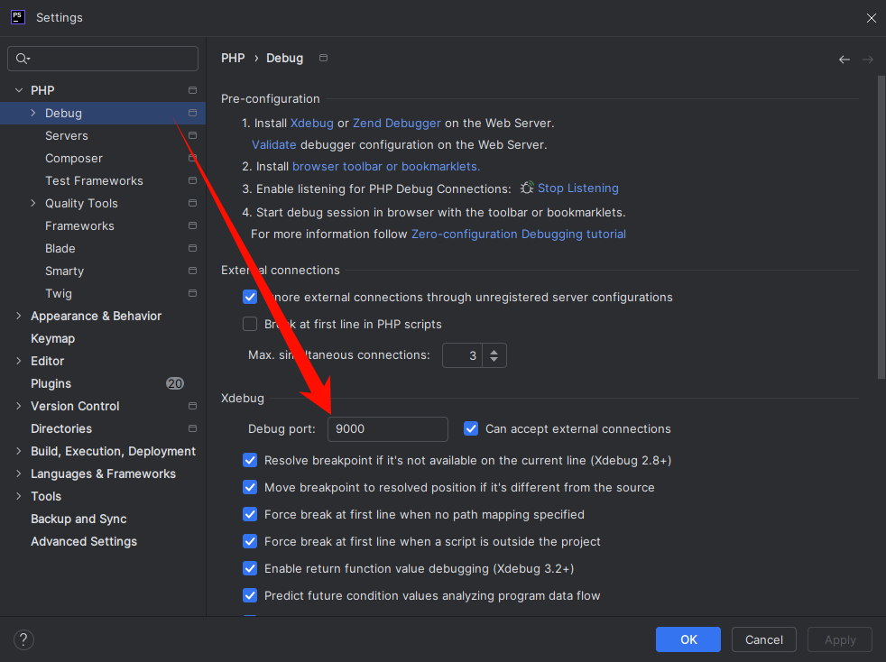

# PhpStorm \+ Xdebug 远程动态调试

---

## 1\. 原理

### 1\.1 调试链路

Xdebug 不是「IDE 连上去调试」，而是 **PHP 进程主动反向连接 IDE**：

```plaintext
浏览器 / Burp / curl
        │
        ▼
  远程 Web（Apache / Nginx+FPM / Docker）
        │  加载 zend_extension=xdebug
        │  命中断点 / 触发调试会话
        ▼
  TCP 连到 IDE 监听端口（默认 Xdebug3: 9003，Xdebug2: 9000）
        │
        ▼
  本机 PhpStorm（DBGp 协议）
```

因此必须同时满足：

|条件|说明|
|---|---|
|扩展匹配|`xdebug.so` 与 PHP 大版本、ZTS/NTS、架构（x86\_64/aarch64）、libc 一致|
|配置正确|写入 **实际处理 Web 请求** 的那个 `php.ini` / `conf.d`|
|网络通|远端 PHP 能访问到 PhpStorm 所在机器的 `client_host:client_port`|
|路径映射|远端绝对路径 ↔ 本地项目路径一一对应|
|触发正确|Cookie / GET / 自动开启任一方式生效|

### 1\.2 三种场景怎么选

|场景|适用环境|做法|
|---|---|---|
|**一、环境可联网**|有外网、可装编译工具|`pecl` / 源码 / 包管理器安装|
|**二、环境无法联网**|内网、靶机、受限主机|上传本仓库预编译 `.so` 或本机交叉编译后拷贝|
|**三、远程 / Docker 联调**|代码在另一台机器或容器|在场景一或二装好扩展后，重点做网络、映射、触发与 PhpStorm|

场景一、二解决的是「把 Xdebug 装进 PHP」；场景三解决的是「让断点打到本机 IDE」。实战中通常是 **一或二 \+ 三**。

### 1\.3 PHP 与 Xdebug 版本对应（必查）

装错版本会出现 `API version mismatch` 或模块直接加载失败。

|PHP|推荐 Xdebug|配置语法|
|---|---|---|
|5\.6|2\.5\.x|Xdebug 2|
|7\.0|2\.6\.x|Xdebug 2|
|7\.1|2\.7\.x|Xdebug 2|
|7\.2 / 7\.3|2\.9\.x|Xdebug 2|
|7\.4|3\.1\.x|Xdebug 3|
|8\.0 / 8\.1 / 8\.2|3\.2\.x / 3\.3\.x|Xdebug 3|
|8\.3|3\.3\.x\+|Xdebug 3|

> 官方兼容矩阵：https://xdebug.org/docs/compat
不确定版本时，用 `php -i | head` / `phpinfo()` 看 PHP 版本与 `Zend Extension Api No`。

### 1\.4 先摸清「当前是谁在跑 PHP」

Web 请求用的配置，往往和 CLI 不是同一份。

```bash
# 1. 有哪些 php / 版本
which php
php -v
php -i | grep -E 'php.ini|Loaded Configuration|extension_dir'

# 2. 常见发行版路径（版本号按实际改）
# Apache 模组：  /etc/php/8.3/apache2/
# PHP-FPM：      /etc/php/8.3/fpm/
# CLI：          /etc/php/8.3/cli/

# 3. 宝塔 / 一键包 / 禅道等非系统路径示例
# /opt/zbox/run/php/php
# /www/server/php/74/bin/php

# 4. Docker 内
find / -name php.ini 2>/dev/null
php -i | grep 'Loaded Configuration'
```

|运行方式|改哪份配置|重启什么|
|---|---|---|
|Apache `mod_php`|`apache2/php.ini` 或 `apache2/conf.d/*.ini`|`systemctl restart apache2` / `httpd`|
|Nginx \+ PHP\-FPM|`fpm/php.ini` 或 `fpm/conf.d/*.ini`|`systemctl restart php*-fpm`|
|CLI / 计划任务|`cli/php.ini`|无需重启，下次命令生效|
|Docker 内同类|容器内对应路径|重启容器或容器内对应服务|

用 Web 页 `phpinfo()` 确认：搜 `xdebug`，以及 `Loaded Configuration File`，避免改错文件。

---

## 2\. 场景一：环境可以联网 — 下载 / 编译安装 Xdebug

### 2\.1 准备编译依赖

Debian / Ubuntu / Kali：

```bash
apt-get update
apt-get install -y php-dev autoconf automake \
  build-essential libtool pkg-config wget
```

若 PHP 不是系统包（如 `/opt/zbox/run/php`），仍装上述工具，但后面一律用该 PHP 的 `phpize` / `php-config`。

RHEL / CentOS：

```bash
yum groupinstall -y "Development Tools"
yum install -y php-devel autoconf automake libtool
```

### 2\.2 方式 A：PECL（推荐，版本合适时最简单）

```bash
pecl install xdebug
# 指定版本示例：
# pecl install xdebug-3.1.6
# pecl install xdebug-2.9.8
```

安装成功后会提示 `zend_extension=` 路径，记下 `.so` 绝对路径，写入对应 `conf.d`。

若 `pecl` 因 PHP 过旧/过新失败，改用源码编译。

### 2\.3 方式 B：源码编译（精确控制版本）

以 PHP 7\.4 / Xdebug 3\.1\.6 为例（按 0\.3 表替换包名）：

```bash
wget https://xdebug.org/files/xdebug-3.1.6.tgz

# 系统 PHP：
phpize
./configure --with-php-config=$(which php-config)
#phpize 和 php-config 是用于编译和安装 PHP 扩展的工具，它们并不包含在基础的 PHP 安装包里，而是由开发包提供。

# 非系统路径 PHP（禅道 zbox 等）：
/opt/zbox/run/php/phpize
./configure --with-php-config=/opt/zbox/run/php/php-config

make -j$(nproc)
make install
# 输出类似：Installing shared extensions: /usr/lib/php/20190902/
```

### 2\.4 方式 C：发行版软件包（能装到对口版本时最快）

```bash
# Debian/Ubuntu 示例（版本随发行版而定，可能偏旧）
apt-get install -y php-xdebug
# 或
apt-get install -y php8.3-xdebug
```

装完后检查 `php -m | grep xdebug` 与 `phpinfo()`。包版本对不上业务 PHP，则退回 A/B。

### 2\.5 写入配置并重启

优先用独立 drop\-in，避免直接改大 `php.ini`：

```bash
# 例：PHP 8.3 + Apache
# 扩展文件：/usr/lib/php/20230831/xdebug.so  （以 make install 输出为准）

cat > /etc/php/8.3/apache2/conf.d/99-xdebug.ini <<'EOF'
zend_extension=xdebug.so
; 若相对路径加载失败，写绝对路径：
; zend_extension=/usr/lib/php/20230831/xdebug.so

; ===== Xdebug 3 =====
xdebug.mode=debug
xdebug.client_host=127.0.0.1
xdebug.client_port=9003
xdebug.idekey=PHPSTORM
xdebug.start_with_request=yes
; 可选：自动发现发起请求的客户端 IP（NAT/复杂网络慎用）
; xdebug.discover_client_host=1
; xdebug.log=/tmp/xdebug.log
; xdebug.log_level=7
EOF

systemctl restart apache2
```

PHP\-FPM \+ Nginx 时改 `fpm/conf.d`，并 `systemctl restart php8.3-fpm`。

**Xdebug 2**（PHP ≤ 7\.3 常见）语法不同，见 附录 A。

### 2\.6 验证安装

```bash
php -m | grep -i xdebug
php -i | grep -i xdebug
```

Web：访问任意 `phpinfo()` 页面，出现 `xdebug` 段落即表示对应 SAPI 已加载。

---

## 3\. 场景二：环境无法联网 — 上传预编译 / 本地编译的 Xdebug

内网、靶场、生产堡垒等不能 `wget` / `pecl` 时，在 **可联网机器** 准备好 `.so`，再拷到目标主机。

### 3\.1 使用本仓库预编译包（glibc，PHP 5\.6–8\.3）

|文件名|PHP|Xdebug|
|---|---|---|
|`xdebug-php5.6-2.5.5-glibc.so`|5\.6|2\.5\.5|
|`xdebug-php7.0-2.6.1-glibc.so`|7\.0|2\.6\.1|
|`xdebug-php7.1-2.7.2-glibc.so`|7\.1|2\.7\.2|
|`xdebug-php7.2-2.9.8-glibc.so`|7\.2|2\.9\.8|
|`xdebug-php7.3-2.9.8-glibc.so`|7\.3|2\.9\.8|
|`xdebug-php7.4-3.1.6-glibc.so`|7\.4|3\.1\.6|
|`xdebug-php8.0-3.2.2-glibc.so`|8\.0|3\.2\.2|
|`xdebug-php8.1-3.2.2-glibc.so`|8\.1|3\.2\.2|
|`xdebug-php8.2-3.2.2-glibc.so`|8\.2|3\.2\.2|
|`xdebug-php8.3-3.3.2-glibc.so`|8\.3|3\.3\.2|

**约束（不满足则必须自己编译）：**

- 目标为 **glibc** Linux（多数 Debian/CentOS）；**Alpine（musl）不可直接用**。

- CPU 架构需一致（当前包一般为 x86\_64）。

- PHP 为 **NTS** 常见构建；若是 ZTS / 特殊定制 PHP，预编译包可能不兼容。

### 3\.2 拷贝与启用步骤

```bash
# 本机解压后，把对应 so 上传到目标

# 在目标机：
php -i | grep extension_dir
# 假设输出 extension_dir => /usr/lib/php/20190902

cp /tmp/xdebug-php7.4-3.1.6-glibc.so /usr/lib/php/20190902/xdebug.so
chmod 755 /usr/lib/php/20190902/xdebug.so
```

Docker 内同样：先 `docker cp` 进容器，再放到该容器 PHP 的 `extension_dir`。

写入配置：

**Xdebug 3（PHP ≥ 7\.4 推荐）：**

```plaintext
zend_extension=xdebug.so
xdebug.mode=debug
xdebug.client_host=192.168.1.100
xdebug.client_port=9003
xdebug.idekey=PHPSTORM
xdebug.start_with_request=yes
xdebug.log=/tmp/xdebug.log
```

**Xdebug 2（PHP 5\.6–7\.3 / 旧 Docker）：**

```plaintext
zend_extension=xdebug.so
xdebug.remote_enable=1
xdebug.remote_handler=dbgp
xdebug.remote_host=192.168.1.100
xdebug.remote_port=9000
xdebug.idekey=PHPSTORM
xdebug.remote_autostart=1
xdebug.remote_log=/tmp/xdebug.log
```

`client_host` / `remote_host` 填 **PhpStorm 所在机器** 的 IP（对 Docker 主机而言常是宿主机网桥 IP，见场景三），不是 Web 站点域名。

重启 Apache / php\-fpm / 容器后，用 `php -m` 与 `phpinfo()` 验证。若日志报 `Unable to load dynamic library` 或 `API version mismatch`，说明 `.so` 与当前 PHP 不匹配 → 改走 2\.3。

### 3\.3 离线自编译（预编译包不可用时）

在一台与目标 **PHP 大版本、操作系统族、架构尽可能接近** 的可联网机器上：

```bash
# 同场景 1.3 完整编译出 modules/xdebug.so
# 然后将 so 与 ini 一起带入内网
```

容器环境更稳妥的做法：基于目标同 tag 镜像，在有网机器上：

```bash
docker run --rm -v "$PWD":/out -w /tmp php:7.4-fpm bash -lc '
  apt-get update && apt-get install -y $PHPIZE_DEPS wget
  wget https://xdebug.org/files/xdebug-3.1.6.tgz
  tar xf xdebug-3.1.6.tgz && cd xdebug-3.1.6
  phpize && ./configure && make
  cp modules/xdebug.so /out/xdebug-php74.so
'
```

得到的 `.so` 再 `docker cp` 到无法联网的容器。

### 3\.4 Docker 内快速落地示例

```bash
# 宿主机
docker cp xdebug-php5.6-2.5.5-glibc.so <容器ID>:/tmp/xdebug.so
docker exec -it <容器ID> bash

# 容器内
php -v
php -i | grep extension_dir
# 例：cp /tmp/xdebug.so /usr/lib/php/20131226/xdebug.so

find / -name php.ini 2>/dev/null
# 一般 Web 改 apache2 或 fpm，不要只改 cli
```

常见 `php.ini` 含义（以 PHP 5\.6 为例）：

1. **`/etc/php/5.6/apache2/php.ini`** — Apache 模组模式

2. **`/etc/php/5.6/cli/php.ini`** — 命令行

3. **`/etc/php/5.6/fpm/php.ini`** — Nginx \+ FPM

可在对应 `conf.d/` 下新建 `99-xdebug.ini`；没有 `conf.d` 时，在所用 `php.ini` **末尾**追加同样内容。

旧版 ini 示例（Xdebug 2）：

```plaintext
zend_extension=xdebug.so
xdebug.remote_enable=1
xdebug.remote_handler="dbgp"
xdebug.remote_host=192.168.137.92   ; PhpStorm 所在机器
xdebug.remote_port=9000
xdebug.remote_log=/var/log/php/xdebug.log
xdebug.idekey=PHPSTORM
; 以下性能分析项可选，日常断点调试可关掉以免拖慢
; xdebug.auto_trace = On
; xdebug.profiler_enable = On
; xdebug.profiler_enable_trigger = On
; xdebug.profiler_output_name = profiler.out.%t.%p
```

---

## 4\. 场景三：远程服务器 / Docker 与 PhpStorm 联调

扩展装好后，在 IDE 侧完成解释器（可选）、服务器映射、Debug 端口、触发与监听。

### 4\.1 PhpStorm：PHP 解释器（可选但建议）

路径示例：**Settings → PHP → CLI Interpreter**


- 纯远程 Web 调试：可用「远程解释器」或仅做路径映射，不强制本机有同版本 PHP。

- Docker：可配 Docker / Docker Compose 解释器，便于 CLI 调试一致。

CLI 解释器调试端口需与服务器 Debug 设置一致：



### 4\.2 PhpStorm：Servers（路径映射，必配）

**Settings → PHP → Servers**

1. Name：任意，需与 Run/Debug Configuration 里选择的一致

2. Host：浏览器访问的主机名或 IP（站点 Host，不是 DBGp IP）

3. Port / Debugger：与站点一致，Debugger 选 Xdebug

4. 勾选 **Use path mappings**

5. Absolute path on the server：远端真实路径（如 `/var/www/html`、容器内 `/app`）

6. 本地路径：本机打开的工程根


### 4\.3 PhpStorm：Debug 端口

**Settings → PHP → Debug**

- Xdebug 3：监听 **9003**

- Xdebug 2：监听 **9000**

- 与 ini 中 `client_port` / `remote_port` **必须一致**


可勾选 Force break at first line（排错时有用）。

### 4\.4 PhpStorm：DBGp Proxy


Host 填 **跑着 Web/代理的那一侧约定地址**；IDE key 与 `xdebug.idekey`、Cookie 一致（如 `PHPSTORM`）。

### 4\.5 调试配置与开始监听

**Run → Edit Configurations → PHP Remote Debug**


1. 选择上文建好的 Server

2. IDE key = `PHPSTORM`（与 ini / Cookie 一致）

3. 工具栏开启 **Start Listening for PHP Debug Connections**（听筒图标）

4. 浏览器装 [Xdebug Helper](https://www.jetbrains.com/help/phpstorm/browser-debugging-extensions.html)，或手工带 Cookie（见 3\.7）

5. 访问会执行到断点的 URL

也可先 Listen，再临时设 `xdebug.start_with_request=yes` / `remote_autostart=1`，任意请求即连入（适合无 Cookie 的 API/CLI）。

#### SSH 反向隧道（远端无法直连你的笔记本）

```bash
# 在你本机执行：把远端的 9003 转到本机 PhpStorm 9003
ssh -R 9003:127.0.0.1:9003 user@remote-web-host
```

远端 ini 中：

```plaintext
xdebug.client_host=127.0.0.1
xdebug.client_port=9003
```

这样 PHP 连本机回环即可转到你的 IDE。

### 4\.6 如何触发一次调试会话

|方式|做法|
|---|---|
|Cookie（推荐）|`Cookie: XDEBUG_SESSION=PHPSTORM`|
|GET/POST|`?XDEBUG_SESSION_START=PHPSTORM`|
|浏览器扩展|设 IDE key 为 PHPSTORM 后点 Debug|
|自动|`start_with_request=yes` / `remote_autostart=1`|

---

## 5\. 常见问题排查

|现象|排查|
|---|---|
|`php -m` 无 xdebug|改错 ini；`zend_extension` 路径错；重启未做；Web/CLI 配置不一致|
|API / ELF / GLIBC 报错|版本、架构、musl/glibc、ZTS/NTS 不匹配，重编或换 so|
|IDE 无 Incoming|防火墙；`client_host` 填成网站 IP；端口 9000/9003 搞反；未 Listen|
|有连接但断点不中|路径映射错误；文件未保存到远端同一路径；Opcode 缓存旧文件|
|只断第一行|映射或触发正常，后续断点文件路径未映射到本地|
|极慢|关 profiler/trace；`mode=debug` 即可，不要长期开 `start_with_request=yes` 于生产|
|Cookie 无效|idekey 不一致；拼写错误；被中间件剥 Cookie|

开详细日志：

```plaintext
; Xdebug 3
xdebug.log=/tmp/xdebug.log
xdebug.log_level=7

; Xdebug 2
xdebug.remote_log=/tmp/xdebug.log
```

日志里常见 `Could not connect to debugging client` → 纯网络/`client_host` 问题。

---

## 附录 A\. Xdebug 2 与 3 配置对照

|用途|Xdebug 2|Xdebug 3|
|---|---|---|
|开启远程调试|`remote_enable=1`|`mode=debug`|
|IDE 地址|`remote_host`|`client_host`|
|端口|`remote_port=9000`|`client_port=9003`|
|每个请求自动连|`remote_autostart=1`|`start_with_request=yes`|
|发现客户端 IP|`remote_connect_back=1`|`discover_client_host=1`|
|日志|`remote_log`|`log` \+ `log_level`|
|IDE Key|`idekey`|`idekey`（不变）|

不要混写两套键名；扩展是 3 却写 `remote_*`，多数会被忽略。

---

## 附录 B\. 最小可用配置模板

**Xdebug 3**

```plaintext
zend_extension=xdebug.so
xdebug.mode=debug
xdebug.client_host=192.168.x.x
xdebug.client_port=9003
xdebug.idekey=PHPSTORM
xdebug.start_with_request=trigger
```

`start_with_request=trigger`：仅带 Cookie/参数时才调试，比 `yes` 更安全。

**Xdebug 2**

```plaintext
zend_extension=xdebug.so
xdebug.remote_enable=1
xdebug.remote_host=192.168.x.x
xdebug.remote_port=9000
xdebug.idekey=PHPSTORM
xdebug.remote_autostart=0
xdebug.remote_log=/tmp/xdebug.log
```

`remote_autostart=0` 时需 Cookie：`XDEBUG_SESSION=PHPSTORM`。

---

## 附录 C. 参考

- Xdebug 官方文档：https://xdebug.org/docs/

- 兼容性：https://xdebug.org/docs/compat

- PhpStorm 远程调试：https://www.jetbrains.com/help/phpstorm/remote-debugging-via-ssh-tunnel.html

- 外链经验文（远程调试补充）：https://zgao.top/phpstorm-xdebug-%E8%BF%9C%E7%A8%8B%E8%B0%83%E8%AF%95%E4%BB%A3%E7%A0%81/


