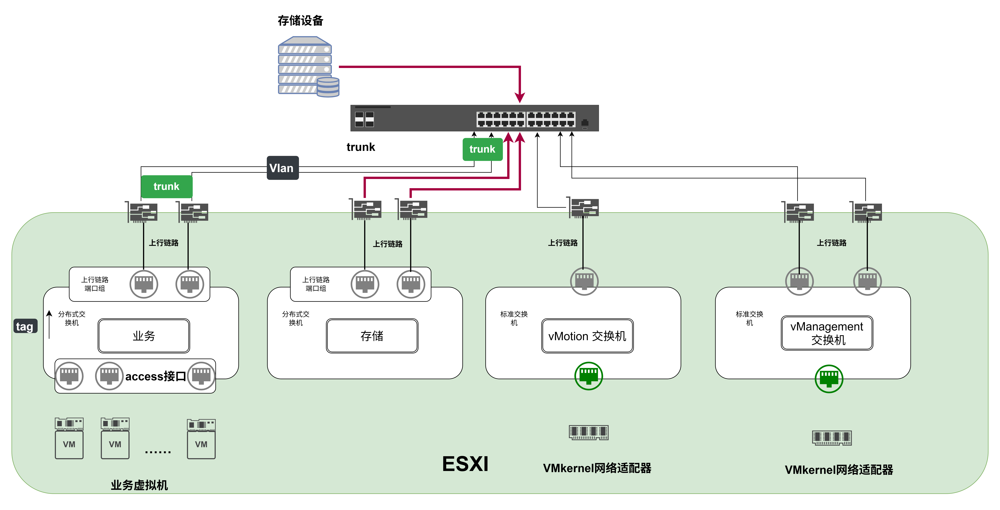
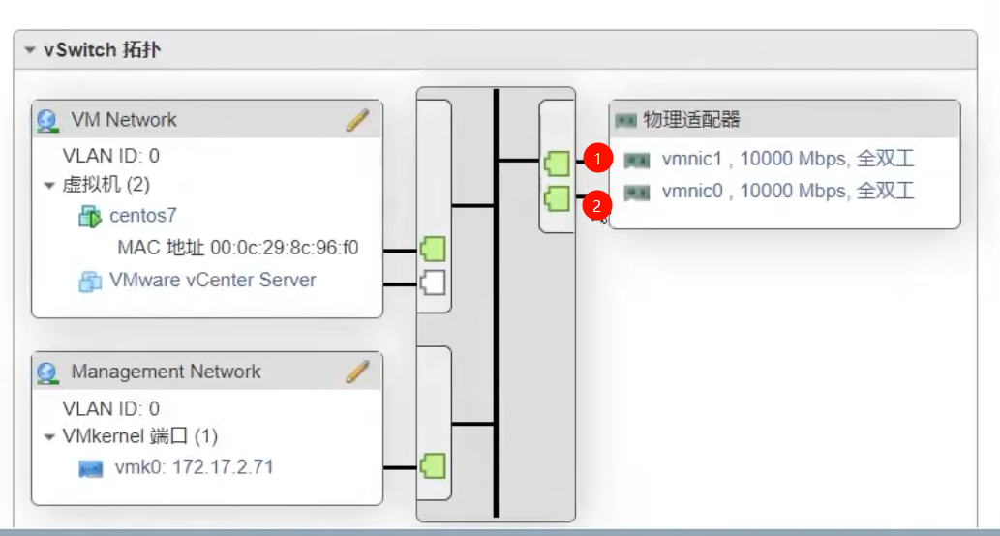
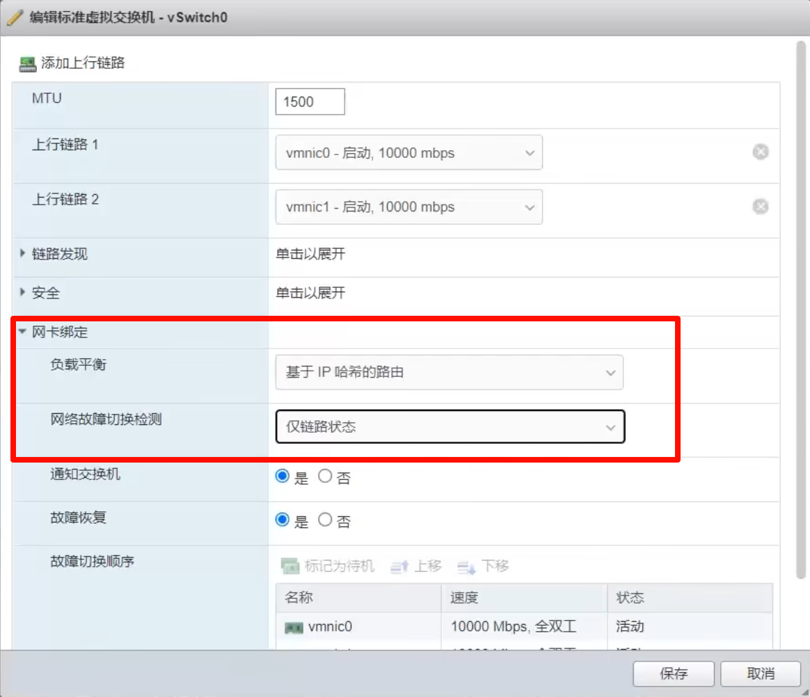
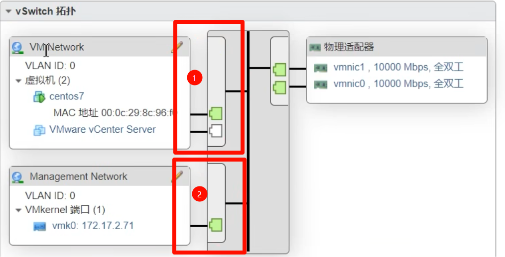
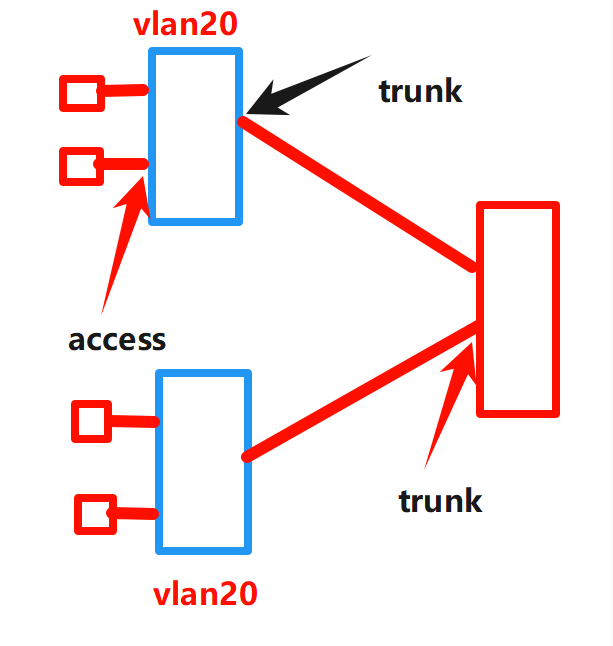
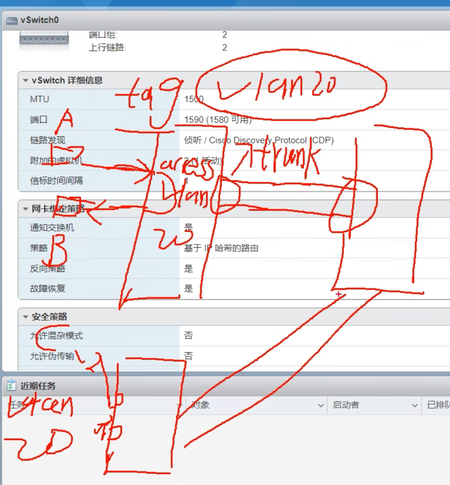

reference:【第 5 讲 虚拟网络与物理网络的对接】 [https://www.bilibili.com/video/BV1XF41147c3/?share_source=copy_web&vd_source=a6ee0ecb5afa8c8ab4046146361b28e9](https://www.bilibili.com/video/BV1XF41147c3/?share_source=copy_web&vd_source=a6ee0ecb5afa8c8ab4046146361b28e9)

根据魏鹏课程，制作了一张 vSphere 的概览网络拓扑图



下面解释一下各个网络部分

## 网络基础概念

### 上行链路（Uplink）

- 虚拟交换机连接到物理网络的通道
- 就是把虚拟交换机"连出去"的那根线

添加上行链路，实现负载均衡



网卡绑定策略，为实现上层链路的负载均衡，增加流量的安全性，稳定性



### 

### 端口组（Port Group）

- 虚拟交换机上的一组端口配置
- 类似于给端口分组打标签



2 是 Management Network，是管理地址，三层交换机，三层端口配置 ip 地址，这里 VMKernel 端口配置了 172.17.2.71，是这台 ESXI 的管理地址。

### VLAN（虚拟局域网）

- 把一个物理网络划分成多个逻辑网络
- 不同 VLAN 的设备无法直接通信（需要路由）
- 通过 **VLAN ID**（1-4094）来区分

在不同的虚拟交换机上，要实现不同交换机上的 vlan 通信，必须要将虚拟交换机和上层交换机实现 trunk，这样通过 access 进入虚拟交换机时会打上 tag，并在不剥离 tag 的情况下进入上层交换机。





## 核心组件详解

### 虚拟交换机（vSwitch）

虚拟交换机是 ESXI 网络的核心组件，它是**纯软件实现**的交换机。

#### 两种类型：

#### vSwitch 的功能：

- **虚拟机之间通信**：同一 vSwitch 上的虚拟机可以直接通信
- **连接外部网络**：通过上行链路连接到物理网络
- **VLAN 标签**：支持 802.1Q VLAN tagging
- **安全策略**：可以设置端口安全、混杂模式等
- **流量控制**：支持流量整形（Traffic Shaping）

### 端口组（Port Group）

端口组是虚拟交换机上的一组端口配置，是虚拟机连接网络的"接口"。

#### 端口组的关键属性：

```
端口组名称：Web_Server_Network
 VLAN ID：100（或VMDk模式）
 安全策略：
混杂模式：拒绝
MAC地址更改：接受
伪造传输：拒绝
```

### 上行链路（Uplink）

上行链路是虚拟交换机连接到物理网卡的"桥梁"。

虚拟交换机 ← 上行链路 → 物理网卡 (vmnic0) ← 网线 → 物理交换机

#### 常见的绑定策略：

- **基于虚拟端口的路由**：每个虚拟机的虚拟网卡固定使用一个物理网卡
- **基于源 MAC 哈希**：根据源 MAC 地址选择物理网卡
- **基于 IP 哈希**：根据源和目标 IP 哈希选择物理网卡（需要物理交换机支持 LACP）

### 虚拟网卡（vNIC）

虚拟机里面的网络接口卡。

#### vNIC 类型：

- **E1000e**：模拟 Intel E1000 网卡，兼容性好但性能一般
- **VMXNET3**：VMware 准虚拟化网卡，性能最佳（推荐）

---

## 网络流量类型

ESXI 中有几种不同的网络流量，理解它们很重要：

### 管理流量（Management Traffic）

- **用途**：vSphere Client 连接到 ESXI 主机

### 虚拟机流量（VM Traffic）

- **用途**：虚拟机与外部网络的通信
- **建议**：按业务类型分 VLAN

### vMotion 流量

- **用途**：虚拟机实时迁移时的内存数据传输
- **特点**：带宽需求大，延迟敏感
- **建议**：万兆网卡，专用 VLAN

### FT（Fault Tolerance）流量

- **用途**：容错功能的主备同步
- **特点**：极低延迟要求
- **建议**：万兆网卡，与 vMotion 分离

### 存储流量（NFS/iSCSI）

- **用途**：访问网络存储

---

## 设计一个生产级虚拟网络

[https://www.bilibili.com/video/BV1mb4y1W71q?spm_id_from=333.788.player.switch&vd_source=6cc0213a1498994019d7ededbca4ac54&trackid=web_related_0.router-related-2206419-bzvv8.1769214952448.333](https://www.bilibili.com/video/BV1mb4y1W71q?spm_id_from=333.788.player.switch&vd_source=6cc0213a1498994019d7ededbca4ac54&trackid=web_related_0.router-related-2206419-bzvv8.1769214952448.333)

